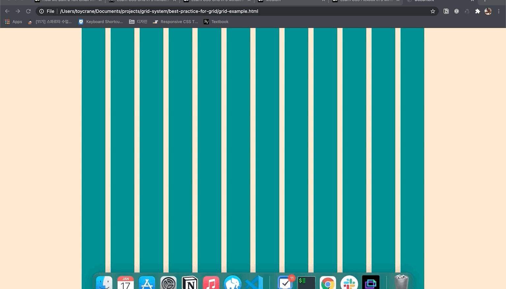

code pot, 사이트를 React를 구현하면서 1차원으로 표현되는 CSS flex에 대한 의문이 생겨서 CSS grid를 공부하고 있습니다.

## flex와 grid 비교해 보기

### flex

- 하나의 방향으로 엘리먼트를 관리하기 좋음 (row, column)
- 각 엘리먼트에 사이즈를 주고 싶을 때, container 단에서 관리가 불가능하고, 각 아이템 별로 size를 주어야 함
- 전체 웹 페이지에 grid를 적용하고 싶을 때에 일관적으로 적용하기가 어려움

### grid

- 2차원으로 엘리먼트를 관리함 (각 영역마다 이름을 줄 수도 있음)
- 최상단 container 단에서 size 관리가 가능함. fr단위를 사용해서 전체를 화면을 효과적으로 나눌 수 있음
- 전체 웹 페이지에 grid를 적용하기 편리함 (컨테이너에 class를 추가하는 방식)
- flex에 비해 구형 브라우저에서 지원이 안되는 단점이 있음

결론은 **왜 이 좋은 걸 이제야 알았을까**입니다 ㅋㅋ

flex와 grid로 구현한 웹페이지 header 코드도 넣어 두었으니, 궁금하신 분들은 한 번씩 보시면 좋을 것 같아요

그런데 문제는 grid를 어떻게 하면 효과적으로 react에 녹아내야 할 지 고민이 됩니다. react는 컴포넌트 단위로 파일을 관리하기 때문에, 한 파일에서 CSS에 대한 정보를 보기가 어려워서 해맬 것 같은 느낌이 옵니다. 여러 레퍼런스를 찾아봤지만, CSS in Javascript(emotion, styled components)로 하기엔 가독성이 떨어져서 어떻게하면 효율적으로 코드를 짤 수 있을지 고민 중입니다.

다음주에 적용해보고 공유하도록 하겠습니다.

## Grid Media Query에 대한 문제

여러 레퍼런스를 찾아 본 결과

### Mobile

margin: 좌우 마진 16px

column: 2분할과 3분할을 할 수 있는 6컬럼

gutter: 16px

### Web

margin: auto

column: 분할이 상대적으로 자유로운 12컬럼 (max → 72px)

gutter: 24px

으로 정해서 여럿 테스트를 해보고 있는데, 애매한 사이즈의 화면이 문제가 됩니다.

아이패드 프로와 같이 큰 화면을 쓰는 기기를 대응할 때 6컬럼을 쓰자니 횡하고, 아이패드 미니와 같은 작은 화면을 쓰는 기기에 12컬럼을 쓰자니 과하고...
중간을 두어야 할 것 같은데 오버 스펙 같은 느낌이고, 참으로 애매한 상황입니다.


그래서 일단은 아래와 같이 스펙을 정하고 프로젝트를 진행해보려고 합니다.

```jsx
.container {
	display: grid;
	grid-template-columns: repeat(6, minmax(0, 72px));
	column-gap: 16px;
	margin: 0 16px;
	justify-content: center;
	background-color: bisque;
}

@media (min-width: 1084px) {
	.container {
		grid-template-columns: repeat(12, minmax(0, 72px));
		column-gap: 16px;
		margin: 0 auto;
	}
}
```

혹시 좋은 의견 있으시면 언제든지 환영입니다.

그리고 위 결론에 다를 때까지 공부했던 자료들 공유합니다.

### Flex 관련

[https://medium.com/free-code-camp/learn-css-flexbox-in-5-minutes-b941f0affc34](https://medium.com/free-code-camp/learn-css-flexbox-in-5-minutes-b941f0affc34)
[https://studiomeal.com/archives/197](https://studiomeal.com/archives/197)

### Grid 관련

[https://medium.com/free-code-camp/learn-css-grid-in-5-minutes-f582e87b1228](https://medium.com/free-code-camp/learn-css-grid-in-5-minutes-f582e87b1228)
[https://studiomeal.com/archives/533](https://studiomeal.com/archives/533)

### Grid System 설정하기

[https://brunch.co.kr/@plusx/3](https://brunch.co.kr/@plusx/3)

[https://medium.com/swlh/the-comprehensive-8pt-grid-guide-aa16ff402179](https://medium.com/swlh/the-comprehensive-8pt-grid-guide-aa16ff402179)

[https://medium.com/swlh/design-system-based-on-the-8pt-grid-2473ca5f0ae1](https://medium.com/swlh/design-system-based-on-the-8pt-grid-2473ca5f0ae1)

[https://medium.com/free-code-camp/learn-css-grid-in-5-minutes-f582e87b1228](https://medium.com/free-code-camp/learn-css-grid-in-5-minutes-f582e87b1228)
