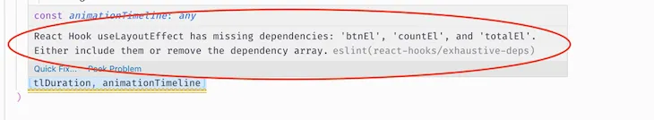
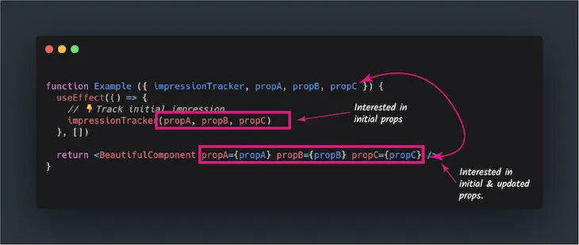

# Hooks API - useMemo (3)

# 비고사항

[이전 useMemo 에 대해 작성한 글](https://www.notion.so/Hooks-API-useMemo-2-205a94499b0c4ee3a78aeadb94a35eda)과 같은 글을 참조하여 이어지는 글입니다.

---

# ESLint 의 빨간줄을 피하기 위한 useMemo 의 사용



ESLint 가 그어주는 빨간 줄을 무시하다간 언젠가 그게 어떻게 돌아올지 모르기 때문에 그때 그때 걷어주는 게 맞긴 하다. 그러나 그와 동시에 그 빨간줄을 무시하고 지나가도 되는 케이스들 또한 존재한다. 

```jsx
function Example({ impressionTracker, propA, propB, propC }) {
	useEffect => (() => {
		// track inital impression
		impressionTracker(propA, propB, propC)
	}, [])

	return <BeautifulComponent propA={propA} propB={propB} propC={propC} />
}
```

impression([일반적으론 감탄이라는 단어로 사용되지만, 프로그래밍에서의 impression 은 웹 사이트의 방문 횟수를 의미한다](https://techterms.com/definition/impression)) 과 관련된 예제 component 다. 

hook 이 시작될 때 `useEffect` 를 이용해 `impressionTracker` 에 집어넣어 해당 함수를 작동을 시키고 나서 반환하는 component 인 `BeautifulComponent` 에 prop 값들을 전달하는 코드이다.

웹페이지의 방문 횟수를 집계하는 함수인만큼 여기선 props 들이 변경이 되든 되지 않든 상관이 없다. 다만, `useEffect` hook 을 통해 `impressionTracker` 라는 함수는 무조건 잘 실행이 되어야 한다. 

그러나 그런 의도로 해당 component 를 작성했다면, ESLint 에서는 빨간 줄을 쫙 그어주면서 다음과 같은 경고 문구를 보여준다

> React Hook useEffect has missing dependencies: 'impressionTracker', 'propA', 'propB', and 'propC'. Either include them or remove the dependency array.



그 이유는 impressionTracker 는 props 의 초깃값에 초점을 두고있고, BeautifulComponent 의 props 들은 초기값과 갱신값에 전부에 초점을 두고 있기 때문이다. 

사실 코드만 봤을 떄 우리가 원하는 로직을 수행하기엔 부족한 부분이 없어 보인다. 그냥 매번 실행될 때마다 impression Tracking 을 해 줄 것이기 때문에 시작할 때 `useEffect` 로 `impressionTracker` 를 실행시켜주면 되고, 매번 실행해야 해서 `useEffect` hook 의 dependency parameter 에 아무것도 넣지 않았을 뿐인데 ESLint 는 dependency array 에 사용한 값들을 채우든 뺴든 처리를 하라고 한다. 그렇다고 Lint 가 이상한 건 아니다. 그냥 Lint 는 할 일을 하는 것 뿐이다. 

이것이 어째서 돌아는 가는 코드이지만 Lint 가 경고문구를 띄우는지는 React 의 Hooks FAQ 에서 [Is it safe to omit functions from the list of dependencies?](https://reactjs.org/docs/hooks-faq.html#is-it-safe-to-omit-functions-from-the-list-of-dependencies) 단락을 참고하면 조금 더 자세한 내막을 알 수 있다. 

원칙 상 useEffect Hook 의 dependency list 에는 useEffect 안에서 돌아가는 함수들이 사용하는 parameter 들을 넣어주어야 하기 때문이다. 

```jsx
function ProductPage({ productId }) {
  const [product, setProduct] = useState(null);

  async function fetchProduct() {
    const response = await fetch('http://myapi/product/' + productId); // Uses productId prop
    const json = await response.json();
    setProduct(json);
  }

  useEffect(() => {
    fetchProduct();
  }, []); // 🔴 Invalid because `fetchProduct` uses `productId`
  // ...
}
```

이 경우는 `useEffect` hook 을 올바르게 사용하지 않았다. 왜냐하면, `useEffect` 가 실행되면서 같이 실행할 함수인 `fetchProduct` 라는 함수가 `productId` 라는 parameter 를 사용하기 때문이다. 그래서 `productId` 가 변경되지 않는 한 굳이 side effect 를 실행시킬 필요가 없어지기 때문에 dependency array paramter 에 `productId` 를 넣어주어야 하는데, 위의 경우에서는 넣어주지 않았기 떄문에 문제가 되는 것이다.

또한 `useEffect` 등의 hook 은 실행 순서를 헷갈리게 하지 않기 위해 component 최 상단에 선언해 주어야 하는데, `fetchProduct` 함수를 먼저 선언하고 그 다음에 hook 을 사용했기 때문에 hook 내부에서 혼동이 있을 수 있다.

```jsx
function ProductPage({ productId }) {
  const [product, setProduct] = useState(null);

  useEffect(() => {
		// useEffect 내부에서 effect hook 에 사용할 함수를 먼저 선언함
		async function fetchProduct() {
	    const response = await fetch('http://myapi/product/' + productId);
	    const json = await response.json();
	    setProduct(json);
	  }

		// 그리고 해당 함수를 실행함
    fetchProduct();
			// 해당 함수는 productId 라는 값을 사용하여 작동하기 때문에 dependency array 에 productId 를 넣어줌
  }, [productId]);
  // ...
}
```

Hook 을 사용할 때의 권장 사항에 따라 저 코드를 다시 고쳐보았다. 사용할 함수를 hook 내부에서 호출 및 선언하고, 그리고 해당 함수에서 사용하는 parameter 들을 dependency list 에 넣어주는 것이 원칙이기 때문에 그 사항을 지켜서 작성하면 이런 코드가 나온다.

다시 `impressionTracker` 가 들어가있는 예제 코드로 돌아가보자

```jsx
function Example ({ impressionTracker, propA, propB, propC }) {
  useEffect(() => {
    // 👇Track initial impression
    impressionTracker(propA, propB, propC)
  }, [])

  return <BeautifulComponent propA={propA} propB={propB} propC={propC} />                 
}
```

일단은 `useEffect` 밖에서, `useEffect` 보다 먼저 `impressionTracker` 를 선언한 것은 아니기 때문에 위치는 괜찮다. 그러나, 그 `impressionTracker` 는 props 로 넘겨받은 요소의 함수이고 해당 component 내에서 선언되지 않았기 때문에 이는 적절한 사용이 아니다.

그렇다고 해서 `impressionTracker` 를 depdency list 에 넘겨주는 것도 Facebook 이 권장하는 방법은 아니다. [React 에서는 dependency list 에 함수를 넘기는 걸 일반적으로 권장하지 않는다고 공식 문서에 명시해 놓았기 때문이다.](https://reactjs.org/docs/hooks-faq.html#is-it-safe-to-omit-functions-from-the-list-of-dependencies)

```jsx
function Example ({ impressionTracker, propA, propB, propC }) {
  useEffect(() => {
    // 👇Track initial impression
    impressionTracker(propA, propB, propC)
  }, [impressionTracker, propA, propB, propC])

  return <BeautifulComponent propA={propA} propB={propB} propC={propC} />                 
}
```

그래서 위의 코드를 고친다면 dependency list 에 `impressionTracker` 를 포함한 모든 props 들이 들어가야 하지만 이렇게 되면 위의 권장하는 방법대로 hook 을 사용한 것이 아니기 때문에 lint 가 경고를 띄우는 것이다. 

사실 이는 어찌 되었든 돌아는 가는 코드이니, 그냥 `eslint-disable-next-line` 등으로 그 코드라인을 무시해버리면 되긴 한다. 그러나 이는 위에 적었듯이 임시방편이고, 이런 짜잘한 문제가 나중에 가서는 거대한 부메랑이 되어 돌아올 지도 모르는 일이기 때문에 어떻게 하면 올바르게 사용할 수 있는지를 고민해 보아야 할 필요성이 있다는 이야기이다. 

## 대안 - useRef hook 사용하기

위의 상황을 다시 한 번 정리해보자

- 우리에게 필요한 것: `impressionTracker` 가 component 가 실행될 때마다 작동하는 것
- 굳이 필요 없는 것: 해당 component 가 props 값이 update 되면서 re-render 되는 것

즉 "props 가 바뀌어도 굳이 update 를 할 필요가 없는, re-render 될 필요가 없는 component" 를 만들어야 하는 상황이다. 이 때는 `useRef` hook 을 사용하는 게 조금 더 적절하다. 

```jsx
const refContainer = useRef(initialValue);
```

> useRef returns a mutable ref object whose `.current` property is initialized to the passed argument (initialValue). The returned object will persist for the full lifetime of the component. - useRef description of the React Docs

```jsx
const refContainer = {
	'current': initialValue,
	// ...,
};
```

React 의 공식문서에서는 `useRef` 가 변경이 가능한 `ref` object 를 만들고, 그 객체의 `.current` property 가 넘겨진 parameter (위의 코드 기준으로는 `initialValue`) 로 초기화된 ref object 를 반환한다고 설명하고 있다. 그리고 mutable 한 속성을 띄고 있기 때문에 `refContainer[current]` 를 통해 접근하여 해당 value 에 내가 원하는 값을 재할당 하는 것도 가능하다.

그럼 `useRef` 를 통해서 어떻게 문제를 해결할 지를 생각해보자. update 되면서 re-render 되지 않게 하려면 해당 값을 함수 내부에서 다시 선언하는 과정이 필요하다. 물론, 코드를 복사-붙여넣기 하여 `useEffect` 내부에서 재 선언한 뒤 작성하는 것도 방법이 될 수 있겠지만, 같은 코드를 여러 번 쓰기 떄문에 좋은 방법은 아니다. 

그렇다면, `useRef` 를 통해 props 들과 `impressionTracker` 를 ref object 의 current 라는 key 에 할당하고, 그 ref object 를 특정 변수에 할당한 다음, useEffect 내부에서 destructive assignment 형식으로 새로운 변수에 할당해 주고 난 뒤 그 변수들을 통해 사용해볼 수 있겠다.

```jsx
function Example({impressionTracker, propA, propB, propC}) {
	// useRef 를 통해 해당 값이 변경이 되더라도 component 가 re-render 되지 않게 처리해준다
	const initialTrackingValues = useRef({
		tracker: impressionTracker,
		params: {
			propA,
			propB,
			propC,
		},
	});

	useEffect(() => {
		// 이제 destructive assignment 를 통해 ref object 가 담긴 initialTrackingValues 의 current 값으로부터 
		// tracker 함수와 params 를 가져온다
		const { tracker, params } = initialTrackingValues.current;

		// 그리고 난 뒤 tracker 함수에 params 를 넣고 실행한다
		tracker(params);
	, []};
	
	return <BeautifulComponent propA={propA} propB={propB} propC={propC}/>
}
```

이렇게 하면 이제 `useRef` 를 통해 "해당 값이 매번 render 될 때마다 같은 값을 전달할 거에요" 라고 명시를 해 주었기 때문에, linter 도 딱히 건드리진 않는다.

> `useRef()` creates a plain JavaScript object. The only difference between useRef() and creating a `{current: ...}` object yourself is that useRef will give you the **same ref object on every render**.

## 여기서 useMemo 를 사용하게 된다면

```jsx
function Example({impressionTracker, propA, propB, propC}) {

  // useMemo to memoize the value i.e so it doesn't change
  const initialTrackingValues = useMemo({
    tracker: impressionTracker, 
    params: {
       propA, 
       propB, 
       propC, 
    }
  }, []) // 👈 you get a lint warning here

  // track impression 
  useEffect(() => {
    const { tracker, params} = initialTrackingValues
    tracker(params)
  }, [tracker, params]) // 👈 you must put these dependencies here
```

간혹, 이런 lint 의 빨간 줄을 피하기 위해서 여태껏 계산한 값 중 `useMemo` hook 을 사용하는 사람들이 있다.

> `useMemo` will only recompute the memoized value when one of the dependencies has changed. This optimization helps to avoid expensive calculations on every render.

그러나 `useMemo` 는 특정 함수를 계산하는 데 많은 연산이 필요할 때 dependency array 에 넣은 값들이 바뀌는 경우에만 해당 연산을 재 수행하고, 그렇지 않으면 가장 최근에 연산한 값을 반환하는, `memoization` 을 위한 기능이지, 저런 식으로 간단한 값들(엄청나게 큰 경우라면 모르겠으나)을 할당하는 걸 `useMemo` 를 통해 할당하는 건 memoization 의 취지에 맞지도 않고, 그렇게 합리적이지도 않다. 

ESLint 가 이런 dependency array 로 난리를 친다면, useMemo 를 찾지 말고 useRef 를 사용하면 해결할 수 있을 지 한 번 생각해보자. 

---

# 참조적 동등성만을 위해 useMemo 를 사용하는 경우

대부분의 사람들은 `useMemo` 를 

- 고 비용 연산(expensive calculation) 을 수행할 때
- 참조적 동등성(referential equalities) 를 유지하려 할 때
    - referential equalities 란 무엇인가? :

사용한다고 한다.

memoization 의 취지에 맞게 사용하는 첫 번째(고비용 연산에 들어가는 자원을 줄이기 위함) 사례는 괜찮지만, 두 번째 사례는 괜찮지 않다. 정확히 말하면, "오직 참조적 동등성을 유지할 용도로서 `useMemo` 를 사용하는 건 적절하지 않다" 

어째서일까? 

```jsx
function Bla() {
	const baz = useMemo(() => [1, 2, 3], []);
	return <Foo baz={baz} />
}
```

`Bla` 라는 component 를 만들었다. 그 안의 `baz` 라는 value 는 memoization 이 이뤄지긴 한다. 단, 그 목적이 해당 연산에 많은 자원이 들어가서 그러느냐 라고 하면, 결코 아니다. memoization 이 이뤄지는 이유는 단 하나, `baz` 라는 변수를 참조하는 값이 render 가 일어날 때마다 변경되기 때문이다. 

```jsx
useMemo(() => [1, 2, 3], []);
```

조금 더 자세히 살펴보기 위해 `useMemo` 부분만 따로 떼어 보았다. dependency array 부분엔 아무 것도 없다. `[1, 2, 3]` 이라는 연산이 이뤄지는 부분의 parameter 는 component 가 mount 될 때 단 한 번만 계산이 이뤄진다. 

다시 말 하자면, 이 `[1, 2, 3]` 이라는 값은 

- 고비용 연산도 아니고
- mount 가 된 뒤 다시 연산이 이뤄지는 것도 아니다

memoization 이란, 한 번 연산하는 데 많은 자원을 사용하여 나중에 다시 연산할 때 이전의 연산 결과를 끌어다 쓰는 걸 의미한다. 위의 경우는 많은 연산을 사용하는 경우도 아닐 뿐더러, 심지어 다시 연산이 이뤄지지도 않는다. 이 말인 즉슨, memoization 의 개념을 사용한 `useMemo` hook 을 사용할 이유가 전혀 없다는 것이다. 

## 그렇다면, 참조적 동등성을 보장하기 위해선 어떻게 해야할까?

우리가 무엇을 하고 싶었는지 다시 한 번 생각해보자.

`baz` 라는 값을 memoization 하려고 하였는가? 아니다. 우리는 그저 참조적 동등성을 유지하고 싶었을 뿐이며 용례엔 맞지 않지만 `useMemo`  를 사용해 그 기능을 구현하였다. 그러나 위에 적은 것처럼 `useMemo` 를 굳이 사용할 필요는 없다는 사실을 알았다.

우리는 해당 component 가 다시 render 되어도 동일한 참조를 유지하고 싶었던 것 뿐이다. 

이 경우에도 `useRef` 를 사용하자. parameter 로 넘겨준 값을 ref object 의 `current` property 에 할당하고, 그렇게 만들어진 ref object 를 반환하며, component 가 re-render 되어도 해당 값이 바뀌지 않는 `useRef` 의 특성을 고려했을 때 `useRef` 를 사용하는 게 더 낫다고 판단할 수 있다. 

```jsx
function Bla() {
	const { current: baz } = useRef([1, 2, 3]);
	return <Foo baz={baz} />
}
```

`useRef` 를 사용해 `[1, 2, 3]` 이라는 값을 `ref.current` 에 할당한다 → 그리고 그 `current` 에 담긴 값을 destructive assignment 를 이용하여 `baz` 라는 변수에 할당한다 

이렇게 하면 해당 component 가 re-render 되어도 해당 값은 변경되지 않으므로 동등한 reference 를 유지할 수 있게 된다. 

물론 안에 있는 값이 바뀌는 경우, 그에 맞춰 계산을 하기 위해 `useMemo` 를 사용하는 게 틀린 건 아니다. 그러나, 재 연산도 하지 않고, 연산하는데 들어가는 자원이 그렇게 많지도 않다면, `useRef` 를 사용하자. `useMemo` 가 dependency array 를 사용할 수 있게 해서 편리하긴 하다만, 적절하게 사용해야 좋은 것이니 적절한 해결책을 항상 고민해보자.