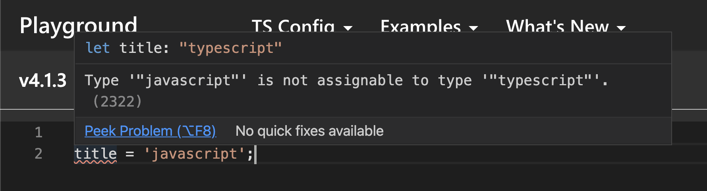
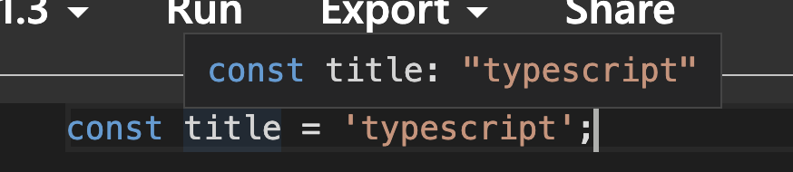
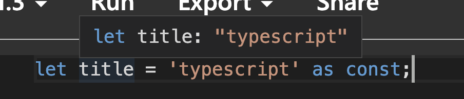
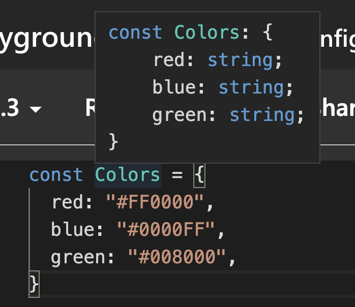
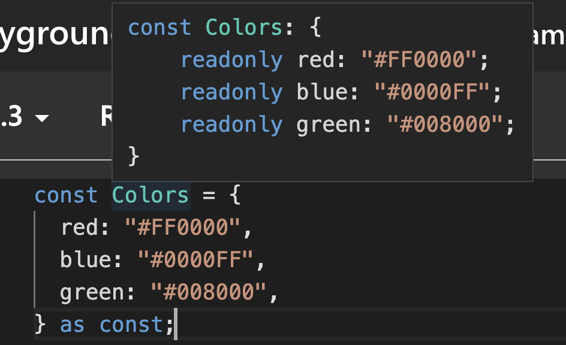
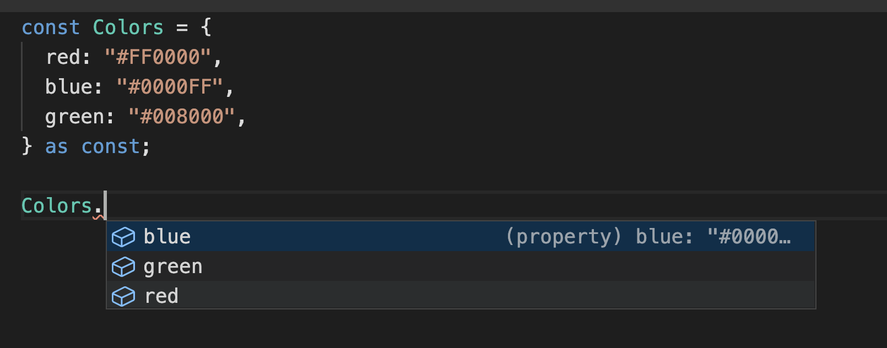
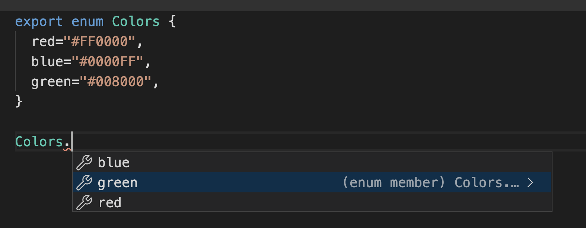

이 번 후기에는 `typescript`를 쓰면서 겪었던 문제를 기록하도록 하겠습니다.

# Typescript에서 상수 관리하기

`Typescript`에서 상수를 쉽게 관리 하기 위해선 몇 가지 사전지식이 필요하여 간단하게 설명하고 넘어가도록 하겠습니다.

## 리터럴 타입

`typescript`에서는 포괄적인 타입(string, number, ....) 외에도 정확한 값을 설정하는 것이 가능합니다.

```tsx
let title: "typescript";
title = "javascript";
```

위와 같이 "typescript" 문자열을 `title`에 타입으로 부여하면 아래와 같이 `title`에 `typescript`가 아닌 다른 값을 입력 시, 컴파일 에러가 발생하게 됩니다. 즉, string, number 등 포괄적인 의미를 담고 있는 primitive type 뿐만 아니라 "typescript" 문자열과 같은 정확한 값을 선언 할 수 있습니다.



## 타입 추론

모든 변수마다 타입을 일일이 적어 주는 것은 여간 번거로운 일이 아닙니다. 그래서 typescript 3.4에서부터는 일일히 타입을 선언하지 않고도 컴파일러가 자동으로 타입을 추론하는 기능을 제공하는데 이에 대해서 알아보도록 하겠습니다.

```tsx
let title = "typescript";
```

위와 같이 `title` 변수를 선언하고 'typescript' 값을 대입 해줬을 뿐인데 똑똑하게도 `title`의 `type`을 `string`으로 추론하였습니다.


이번에는 `const`를 통해 상수를 선언해 보도록 하겠습니다.

```tsx
const title = "typescript";
```

알아서 `title`의 `type`을 리터럴 타입인 "typescript"를 추론한 것을 알 수 있습니다.



이런 차이가 발생하는 이유는 무엇일까요?

`let`은 변수의 값을 언제든 바꿀 수 있고, `const`의 특성 상 변경할 수 없기 때문에 그렇습니다. 그래서 `let`의 경우 좀 더 포괄적인 개념의 `primitive type(string)`으로 값을 추론하는 것이고, `const`의 경우는 `literal type`인 "typescript"로 추론하게 됩니다.

## 타입 단언하기 (const assertion)

`let` 변수의 경우에도 `const`처럼 `literal type`으로 추론해 줄 수 있는데, 그 때 사용하는 것이 `as const` 입니다.

```tsx
let title = "typescript" as const;
```

`title` 변수에 `literal type`으로 "typescript"가 추론 된 것을 알 수 있습니다.



## const assertion 언제 써야 할까? (상수 관리하기)

```tsx
const Colors = {
	red: "#FF0000",
	blue: "#0000FF",
	green: "#008000",
};
```

각 컬러의 대문자를 담은 Colors 변수를 선언해보겠습니다.



Colors 변수 내부에 추론된 값을 보면 각 속성 별로 리터럴 타입이 아닌 primitive type(string)으로 추론 된 것을 알 수 있습니다. 이유는 const 변수로 Object를 선언했지만 Object 내부의 속성 값들은 언제든 바꿀 수 있기 때문입니다.

이 때 `const` `assertion`을 활용해서 `Colors`를 내부의 속성들을 리터럴 타입으로 변경해보도록 하겠습니다.

```tsx
const Colors = {
	red: "#FF0000",
	blue: "#0000FF",
	green: "#008000",
} as const;
```



위의 화면처럼 `colors` 내부의 속성들의 타입이 리터럴 타입으로 추론된 것을 알 수 있습니다.

```html
export default { red: "RED", blue: "BLUE", green: "GREEN", } as const;
```

이렇게 단언된 `Object`를 외부에서 `import`하여 사용하면 아래의 화면처럼 `key`들을 자동으로 추론할 수 있게 되고, 편리하게 상수를 관리할 수 있게 됩니다.



## enum을 통한 상수 관리

```tsx
export enum Colors {
	red = "#FF0000",
	blue = "#0000FF",
	green = "#008000",
}
```

`typescript`에서는 `enum`이라는 객체를 통해서 또한 상수를 쉽게 관리 할 수 있습니다.



`enum`을 통해 `Colors`를 선언해주었는데, `const assertion`과 마찬가지로 `type`이 자동으로 추론되는 것을 알 수 있습니다.

`enum`은 `typescript`에서 제공하는 문법으로 크게 몇 가지 특징이 있습니다.

- enum은 Javascript 객체이나 내부 속성을 임의로 변경할 수 없습니다.
- enum의 내부 key는 반드시 리터럴 타입(문자열 혹은 숫자)로만 사용 가능합니다.
- enum의 속성 값 또한 마찬가지로 리터럴 타입(문자열 혹은 숫자)만 사용이 가능합니다.

## Wrap-Up

`enum`의 경우, `ECMAScript`에서 지원하는 표준 문법이 아니기 때문에 `javascript`로 `transpiling`이 되면 원본 TS 코드와 모습이 많이 다릅니다. 그래서 구글에서 찾아본 결과 몇몇 분들은 사용하지 않는다고 하는 분들이 있었습니다. 그러나 저는 코드를 `typescript`로 작성했고, 내부가 어떻게 돌아가는지(`javascript`로 `transfiling`된 코드)까지는 크게 알 필요가 없다고 생각하기 때문에 저는 아무래도 `enum`을 사용할 것 같습니다. 2가지 방법을 소개시켜드렸으니 취사에 맞추어 쓰시면 될 것 같습니다. 다른 의견이 있으신 분은 언제든 댓글 달아 주세요.

## 참고자료

[TypeScript 3.4: const assertion](https://medium.com/@seungha_kim_IT/typescript-3-4-const-assertion-b50a749dd53b)

[Managing Key-Value Constants in TypeScript](https://dev.to/angular/managing-key-value-constants-in-typescript-221g)

[TypeScript enum을 사용하는 이유](https://medium.com/@seungha_kim_IT/typescript-enum%EC%9D%84-%EC%82%AC%EC%9A%A9%ED%95%98%EB%8A%94-%EC%9D%B4%EC%9C%A0-3b3ccd8e5552)

[[TypeScript] 타입스크립트 기초 - 10](https://ujeon.medium.com/typescript-%ED%83%80%EC%9E%85%EC%8A%A4%ED%81%AC%EB%A6%BD%ED%8A%B8-%EA%B8%B0%EC%B4%88-10-34d0b16bed0f)
