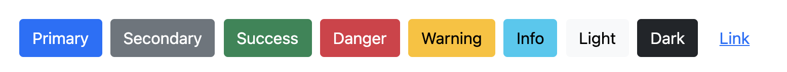
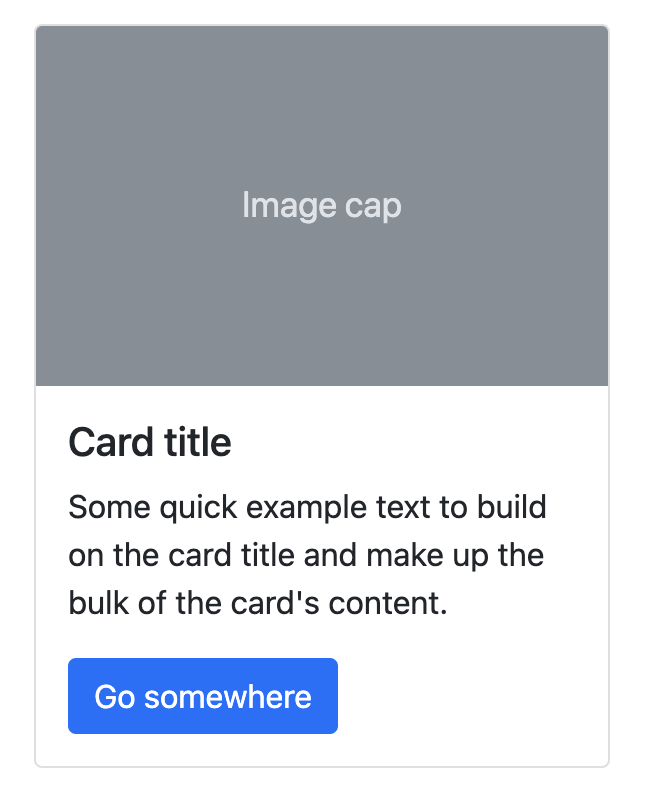
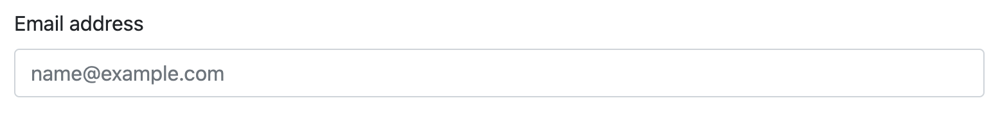
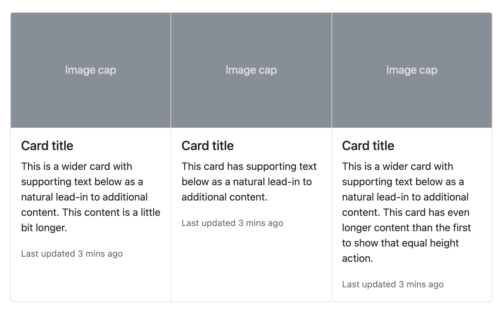
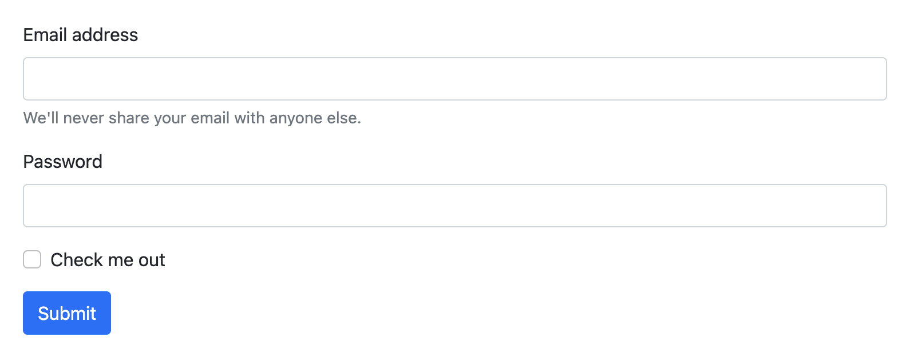
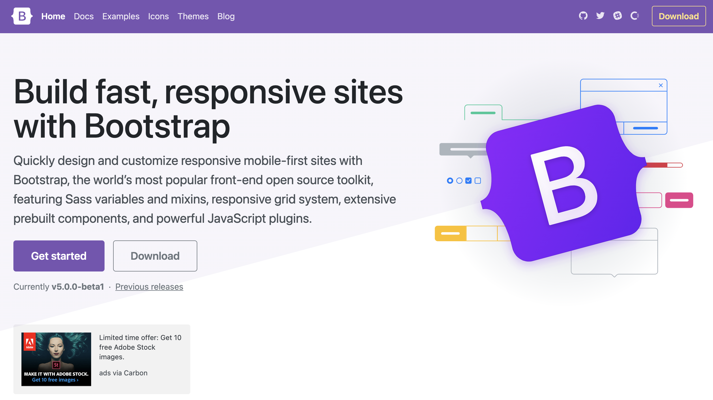

# Atomic Design으로 React를 폴더 트리 만들기

## atomic Design?

`Atomic Design`은 오랫동안 디자인 쪽에서 이야기하는 일관적이고, 재사용이 가능한 디자인할 수 있는 시스템입니다. `React`도 마찬가지로 재사용이 가능한 컴포넌트 단위로 웹페이지를 구현하기 때문에 많은 개발자들이 `Atomic Design`을 코드에 적용하고 있습니다.

## atomic Design의 구성요소

`atomic design`에서는 컴포넌트를 `atoms`, `molecules`, `organisms`, `templates`, 그리고 `pages`로 나눕니다. 각각에 요소들이 어떻게 구성되는지 상세하게 알아보도록 하겠습니다.




단어의 뜻처럼 다른 컴포넌트로 쪼개질 수 없는 가장 작은 단위의 컴포넌트를 의미합니다. 여기에 해당하는 것들로 Button, Input, form 등이 있습니다. 또한 각 컴포넌트의 이벤트에 맞춘 스타일들이 포함될 수 있습니다 (click, hover, focus ....)

### Molecules (분자)




Molecules 여러 Atom을 합쳐서 최소한의 역할을 할 수 있는 그룹을 이야기합니다. 위와 같이 Card, 여러 input과 label 합쳐 하나로 만든 form이 이에 해당됩니다. 또한 Molcules의 경우 Atom과는 달리 기능을 지닐 수 있습니다. 카드를 예로 들면 Go sumewhere 버튼 하면 특정 url로 이동하는 것들이 Molecules 단위에서는 가능해 집니다.

### Organisms (유기체)



Organisms은 여러 Molecules의 집합체이며, 페이지 내에 배치를 위한 최소한의 단위입니다. 위 예시처럼 Card-group, form-group , header, footer 가 이에 해당됩니다.

### Templates


template 단계에서는 Organisms과 여러 component를 배치하는 단계입니다. 위치를 정하고, 간격을 정합니다. 하지만 스타일과 색, 컴포넌트는 아직 그리지 않고, wireframe처럼 배치만 신경씁니다.

### Page


정해진 template에 데이터와 style을 넣어 완성시키는 단계입니다. url 단위로 routing되는 페이지를 이 단계에서 구성합니다.

## Folder Tree 만들기

그럼 위 `atomic Design`에 맞추어 `folder`를 구성해보도록 하겠습니다.

```jsx
├── components
│		├── atoms		              # atoms 컴포넌트
│		│     ├── Button
│		│     │   ├── index.js
│		│     │   ├── stories.js
│		│     ├── Input
│		│     │   ├── index.js
│		│     │   ├── stories.js
│		├── molecules		          # molecules 컴포넌트
│		│     ├── Card
│		│     │   ├── index.js
│		│     │   ├── stories.js
│		├── organisms		          # organisms 컴포넌트
│		│     ├── CardList
│		│     │   ├── index.js
│		│     │   ├── stories.js
│		│     ├── Header
│		│     │   ├── index.js
│		│     │   ├── stories.js
│		├── molecules		          # molecules 컴포넌트
│		│     ├── Card
│		│     │   ├── index.js
│		│     │   ├── stories.js
│		├── Template		          # Template 컴포넌트
│		│     ├── MainGrid
│		│     │   ├── index.js
│		│     │   ├── stories.js
└──pages                     # atomic design을 위한 pages
		├── MyPage
          ├── templates
              └── index.tsx
```

위와 같이 폴더 `tree`를 구성하면 `atomic`하면서도 각 컴포넌트가 겹치지 않게 재사용성을 높일 수 있지 않을까 생각합니다. 게다가 각 컴포넌트 별로 `storybook`을 추가하여 쉽게 각 컴포넌트 단위로 실제 UI를 확인할 수 있게 됩니다.

## Wrap-Up

`folder tree`의 경우, `React`에서 정해준 표준이 없기 때문에 답은 없습니다. 그렇기 때문에 여러 글들을 읽어보고 자신의 상황에 맞추어 쓰는 것이 최선이라고 생각합니다. 더불에 제가 요즘에 `Design System` 빠져있기 때문에 위와같이 `Atomic Design`을 활용하여 `folder`를 구성해봤습니다. 이외에도 좋은 방법이 있다면 댓글로 언제든 의견 주세요.

## Reference

[https://codeburst.io/atomic-design-with-react-e7aea8152957](https://codeburst.io/atomic-design-with-react-e7aea8152957)

[https://velog.io/@thsoon/쓸때없이-고퀄인-투두리스트-만들기-FE-2.-뷰-설계](https://velog.io/@thsoon/%EC%93%B8%EB%95%8C%EC%97%86%EC%9D%B4-%EA%B3%A0%ED%80%84%EC%9D%B8-%ED%88%AC%EB%91%90%EB%A6%AC%EC%8A%A4%ED%8A%B8-%EB%A7%8C%EB%93%A4%EA%B8%B0-FE-2.-%EB%B7%B0-%EC%84%A4%EA%B3%84)
