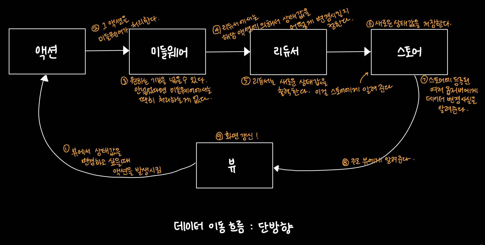

# 1. Redux 소개
> 상태 관리 라이브러리

- 애플리케이션의 전체 상태를 관리할 수 있다.
- 컴포넌트 코드로부터 상태 관리 코드를 분리할 수 있다.
- 미들웨어를 활용한 다양한 기능 추가
    - 데이터를 처리하는 과정 중간에 어떤 로직을 넣어서 필요한 기능을 추가할 수 있다.
    - 강력한 미들웨어 라이브러리 (ex. redux-saga)
    - 로컬스토리지에 데이터 저장하기/불러오기
- Server Side Rendering시 데이터 전달이 간편하다.
    - 리덕스의 상태값은 하나의 객체로 표현이 가능하다. 따라서 그 하나의 객체만 문자열로 변환해서 서버에서 클라이언트로 전달하면 되기 때문에 간편하다.
- Context API 보다 효율적인 렌더링 기능
    - Redux를 사용하지 않고 리액트의 Context API를 사용해도 되지 않냐고 생각하시는 분들도 있을텐데, Redux를 사용하면 좀 더 효율적인 렌더링이 가능하다.

<br>

# 2. Redux 구조

1. 뷰에서 상태값을 변경하고 싶을 때 액션을 발생시킨다.
2. 그 액션을 미들웨어가 처리한다.
3. 미들웨어에는 원하는 기능을 넣을 수 있다. 기능을 넣지 않을 경우 미들웨어에서는 딱히 처리하는 게 없다.
4. 리듀서에서는 해당 액션에 의해서 상태값을 어떻게 변경시킬지 정한다.
5. 리듀서는 새로운 상태값을 출력한다. 이걸 스토어에게 알려준다.
6. 스토어는 새로운 상태값을 저장한다.
7. 스토어에 등록된 여러 옵저버에게 데이터 변경 사실을 알려준다.
8. 주로 뷰에게 새로운 데이터를 알려준다.
9. 뷰에서는 화면이 갱신된다.

<br>

## 3. 액션
> 액션은 type 속성값을 갖고 있는 객체이다.

```js
store.dispatch({ type: 'todo/ADD', title: '영화 보기', priority: 'high' });
store.dispatch({ type: 'todo/REMOVE', id: 123 });
store.dispatch({ type: 'todo/REMOVE_ALL' });
```
- `dispatch`는 액션이 발생했다는 것을 Redux에게 알려주는 함수
- `type` 속성값 말고 다른 필요한 데이터를 원하는대로 전달할 수 있다.
- 이 데이터는 리듀서에서 받아서 처리한다.
- 액션을 구분하기 위해서 `type` 속성값을 사용하는 것이기 때문에 유니크해야 한다. (보통 prefix를 붙여서 사용한다.)

#### Action Creator 함수로 분리 
```js
function addTodo({ title, priority }) {
  return { type: 'todo/ADD', title, priority };
}

function removeTodo({ id }) {
  return { type: 'todo/REMOVE', id };
}

function removeAllTodo() {
  return { type: 'todo/REMOVE_ALL' };
}

store.dispatch(addTodo({ title: '영화 보기', priority: 'high' }));
store.dispatch(removeTodo({ id: 123 }));
store.dispatch(removeAllTodo());
```
- 일반적으로 이렇게 Action Creator 함수를 만들어서 그것을 호출하여 입력한다.
- Action Creator가 일종의 문서 역할을 할 수 있다.