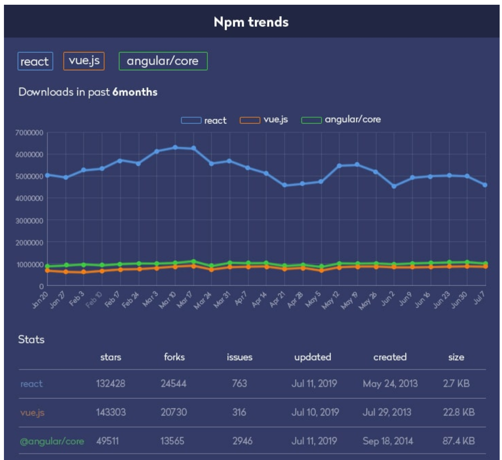

# 리액트를 왜 쓰는가?

- 사용자 인터페이스를 만들기 위한 JavaScript 라이브러리 
- 유지보수를 쉽게 하기 위해서 
- 웹이 무거워져서
- DOM 상태 관리
- 데이터 처리를 쉽게 하려고 
- 웹에서 중복되는 요소를 하나의 컴포넌트로 만들 수 있어서 편리
- 사용자 경험이 좋아짐 

# 리액트 vs 앵귤러 vs 뷰

### npm 트렌드
   - 리액트가 비중이 가장 높다.
   - 앵귤러는 리액트보다 웹 애플리케이션을 더 쉽고 빠르게 개발할 수 있지만 규모 확장 면에서 리액트의 아키텍처가 더 간단합니다.
   - 앵귤러(Angular) : 프로젝트 생성부터 코드 최적화 작업에 이르기까지 모든 작업에서 사용할 수 있는 폭넓은 프레임워크
   - 리액트(React) : 유연성을 제공합니다. 어떠한 라이브러리도 리액트에 맞춰서 개발할 수 있습니다.
   - 뷰(Vue) : 프리코딩(pre-coding) 구조를 가지고 있어서 성능을 양보하지 않고도 애플리케이션을 빠르게 개발할 수 있습니다.


### 1.1. 첫 리액트 컴포넌트 만들기
   - react 라이브러리 : react의 전반적인 코드를 담당합니다.
   - react-dom 라이브러리 : react 코드를 웹에 붙여주는 역할을 합니다.
   - 실제 배포할 때는 production 모드로 바꿔서 배포합니다.
   - class를 컴포넌트로 사용이 가능합니다

### 1.2. React를 이용해서 간단한 로또 만들기
   - 요구사항은 다음과 같습니다.
     - 1. 실제 로또처럼 0~45까지의 수가 랜덤으로 나오도록 구현
     - 2. 버튼을 누를 때마다 새로운 랜덤 수가 화면에 표시됩니다.

​   - 먼저 크게보면 App 컴포넌트와 Lotto 컴포넌트가 존재합니다.
     - App 컴포넌트의 경우 전체 contents
     - Lotto 컴포넌트는 Lotto 박스 한 개를 의미합니다.

   - 1. Lotto
     - Lotto의 경우 Math.random을 이용해서 0 ~ 45의 값을 렌더링합니다.

```javascript
  const Lotto = () =>{
          const number = Math.ceil(Math.random() * 45);
          return(
              <div className="lotto-content">
                {number}
              </div>  
          );
       }
``` 
- 2. App

   - 로또는 6개의 숫자로 구성이 되기 때문에 Lotto 컴포넌트를 6개를 만들었습니다.

   - form 태그를 이용해서 다시 뽑기 버튼을 누를 때마다 랜덤 로또 숫자 6개가 생성됩니다.

```javascript
const App= () =>{

          return(
            <React.Fragment>
            <div className ="lotto-container">
               <Lotto/>
               <Lotto/>
               <Lotto/>
               <Lotto/>
               <Lotto/>
               <Lotto/>
            </div>
            <form>
                <button className="recycle-btn">다시 뽑기</button>
            </form>
            </React.Fragment>
          )
```

- 3. css

   - css의 경우 전체 소스는 다음과 같습니다.

   - lotto-container의 경우 Lotto 컴포넌트를 감싸는 큰 container

   - lotto-content는  Lotto 컴포넌트의 css

   - recycle-btn의 경우 다시 뽑기에 대한 css
  
```css
body{
  margin:0;
  padding:0;
}
.lotto-container {
  display:flex;
  justify-content:space-between;
  width:50%;
  height:100px;
}

.lotto-content{
  width:50px;
  height:50px;
  background-color:#e9e9e9;
  text-align: center;
  padding-top:15px;
  box-sizing: border-box;
}

.recycle-btn{
  margin-left:240px;
  border:0px;
  border:1px solid #e9e9e9;
  cursor:pointer;
}
.recycle-btn:hover{
  background-color:#04c584;
}

```

- html 전체 소스 
```javascript
<html>
  <head>
    <meta charset="utf8">
    <script crossorigin src="https://unpkg.com/react@16/umd/react.development.js"></script>
    <script crossorigin src="https://unpkg.com/react-dom@16/umd/react-dom.development.js"></script>
    <script src="https://unpkg.com/babel-standalone@6/babel.min.js"></script>
    <link rel="stylesheet" href="./style.css">
  </head>
  <body>
    <div id="root"></div>

    <script type="text/babel">
       const Lotto = () =>{
          const number = Math.ceil(Math.random() * 45);
          return(
              <div className="lotto-content">
                {number}
              </div>  
          );
       }
    
       const App= () =>{

          return(
            <React.Fragment>
            <div className ="lotto-container">
               <Lotto/>
               <Lotto/>
               <Lotto/>
               <Lotto/>
               <Lotto/>
               <Lotto/>
              
            </div>
            <form>
                <button className="recycle-btn">다시 뽑기</button>
            </form>
            </React.Fragment>
          )
       }
    </script>
    <script type="text/babel">
      ReactDOM.render(<App/>, document.querySelector('#root'));
    </script>

  </body>
</html>
```

- html 속성과 상태(state)
   - 컴포넌트는 상태를 가짐
   - 상태는 바뀌는 부분이다!
   - 상태는 this.state
   - React 확장 프로그램을 설치하면 좋음 