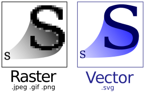
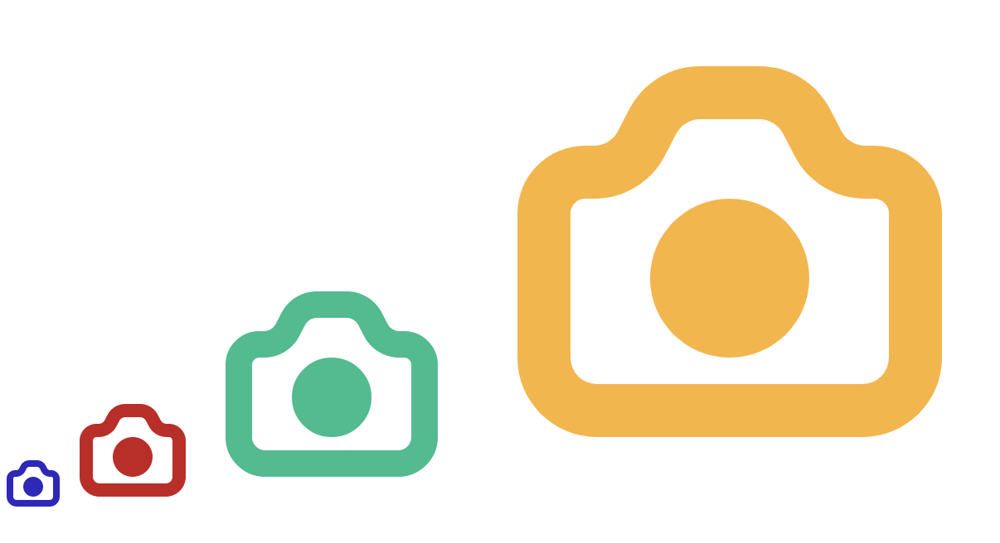
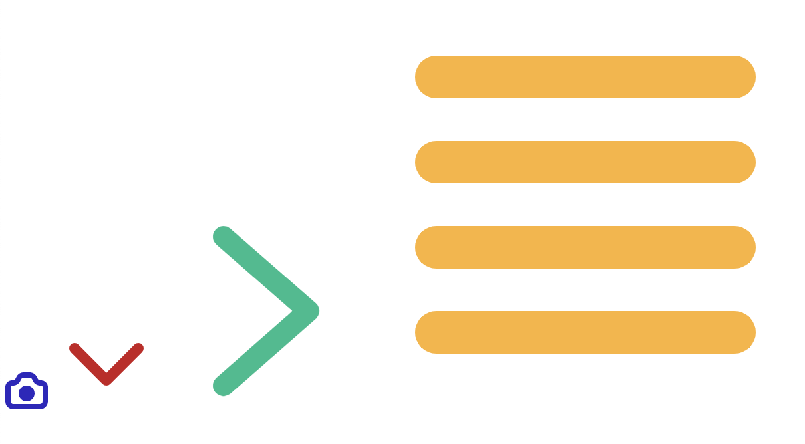

# type safe하게 React에서 Icon 다루기

## SVG?

SVG의 정의를 mozila에서 찾아보면 아래와 같이 설명이 되어 있습니다.

> 확장 가능한 벡터 그래픽(Scalable Vector Graphics), SVG는 그래픽을 마크업하기 위한 W3C XML의 특수언어(dialect)입니다.

어려운 말들의 집합이지만 쉽게 풀어보자면, **SVG를 활용하면 그래픽을 HTML의 태그처럼 조작할 수 있게끔 해주는 기능**이라고 보시면 좋을 것 같습니다.

설명만 들어도 일반적 이미지(.jpeg, .gif, .png)보다 조작이 어려워 보이는데, 왜 쓰는 것일까요?



SVG는 위 그림처럼 백터기반이기 때문에 기존 비트맵 기반 포맷(.jpeg, .gif, .png)과 달리 이미지가 아무리 커져도 그래픽이 깨지지 않고, 매끄럽게 표현이 됩니다. 그렇기 때문에 주로 아이콘이나 로고 같이 그래픽 크기의 확장이 필요한 곳에 많이 사용됩니다.

## SVG 태그 알아보기


아래 SVG 태그는 위에 첨부된 Icon의 SVG 태그 입니다.

```jsx
<svg
	width="200"
	height="200"
	viewBox="0 0 20 20"
	fill="none"
	xmlns="http://www.w3.org/2000/svg"
>
	<path
		fill-rule="evenodd"
		clip-rule="evenodd"
		d="M11.1175 3C12.2379 3 13.265 3.62437 13.7808 4.61905L14.217 5.46032C14.3889 5.79188 14.7312 6 15.1047 6H15.4444C16.8558 6 18 7.14416 18 8.55556V14C18 15.6569 16.6569 17 15 17H5C3.34315 17 2 15.6569 2 14V8.55556C2 7.14416 3.14416 6 4.55556 6H4.89527C5.26875 6 5.61111 5.79188 5.78303 5.46032L6.21924 4.61905C6.735 3.62437 7.76206 3 8.8825 3H11.1175ZM11.1175 5H8.8825C8.50902 5 8.16667 5.20812 7.99475 5.53968L7.55854 6.38095C7.04278 7.37563 6.01571 8 4.89527 8H4.55556C4.24873 8 4 8.24873 4 8.55556V14C4 14.5523 4.44772 15 5 15H15C15.5523 15 16 14.5523 16 14V8.55556C16 8.24873 15.7513 8 15.4444 8H15.1047C13.9843 8 12.9572 7.37563 12.4415 6.38095L12.0052 5.53968C11.8333 5.20812 11.491 5 11.1175 5ZM10 8C11.6569 8 13 9.34315 13 11C13 12.6569 11.6569 14 10 14C8.34315 14 7 12.6569 7 11C7 9.34315 8.34315 8 10 8Z"
		fill="#1A1A1A"
	/>
</svg>
```

위 태그를 보면, `path` 태그를 통해서 카메라 아이콘를 표현한 것을 알 수 있습니다. 좀 더 자세한 문법이 알고 싶으신 분은 [링크](https://developer.mozilla.org/ko/docs/Web/SVG/Tutorial/Basic_Shapes)를 통해서 확인 해보시길 바랍니다.

위에 svg 코드를 보면 `fill` , `width`, `height`, `viewbox` 등등 많은 속성들이 있습니다. 이 중에서 앞으로 컴포넌트로 아이콘을 구성하는데 중요한 속성 중에 하나인 `viewbox`에 대해서 알아보도록 하겠습니다.

### viewbox 속성

```jsx
viewBox = "<min-x>, <min-y>, <width>, <height>";
```

viewbox는 현재 SVG 태그 내부에서 그래픽의 사이즈를 표현합니다. 즉, `viewbox`가 `0 0 16 16` 으로 되어있고, `width=16px`, `height=16px`로 되어 있다면 SVG 태그 내에서 (0,0) 좌표에서 시작하는 `16x16` 의 화면을 svg 태그의 `32x32`의 화면에 출력합니다. 여기서 `width`와 `height`의 비율이 `viewbox`의 `width`와 `height`의 비율이 같다면 비율 비만큼 그래픽이 커지게 됩니다.


```jsx
<svg
	width="400"
	height="400"
	viewBox="0 0 20 20"
	fill="none"
	xmlns="http://www.w3.org/2000/svg"
>
	<path
		fill-rule="evenodd"
		clip-rule="evenodd"
		d="M11.1175 3C12.2379 3 13.265 3.62437 13.7808 4.61905L14.217 5.46032C14.3889 5.79188 14.7312 6 15.1047 6H15.4444C16.8558 6 18 7.14416 18 8.55556V14C18 15.6569 16.6569 17 15 17H5C3.34315 17 2 15.6569 2 14V8.55556C2 7.14416 3.14416 6 4.55556 6H4.89527C5.26875 6 5.61111 5.79188 5.78303 5.46032L6.21924 4.61905C6.735 3.62437 7.76206 3 8.8825 3H11.1175ZM11.1175 5H8.8825C8.50902 5 8.16667 5.20812 7.99475 5.53968L7.55854 6.38095C7.04278 7.37563 6.01571 8 4.89527 8H4.55556C4.24873 8 4 8.24873 4 8.55556V14C4 14.5523 4.44772 15 5 15H15C15.5523 15 16 14.5523 16 14V8.55556C16 8.24873 15.7513 8 15.4444 8H15.1047C13.9843 8 12.9572 7.37563 12.4415 6.38095L12.0052 5.53968C11.8333 5.20812 11.491 5 11.1175 5ZM10 8C11.6569 8 13 9.34315 13 11C13 12.6569 11.6569 14 10 14C8.34315 14 7 12.6569 7 11C7 9.34315 8.34315 8 10 8Z"
	/>
</svg>
```

`width`와 `height`를 `viewbox` 가로 세로 비율에 맞추어 `400px`로 변경하였더니, 위처럼 그대로 그래픽이 확대된 것을 알 수 있습니다.

## SVG Path 단순화 하기

아이콘 별로 SVG 내 path가 다르고, 구현 방식도 다르기 때문에 아이콘을 컴포넌트화 하려면 path를 하나로 통합할 필요가 있습니다. 만약에 path가 여러 개 있다면 아래의 SVG 최적화 사이트에 접속하여 SVG 그래픽을 최적화 해주세요..

[https://jakearchibald.github.io/svgomg/](https://jakearchibald.github.io/svgomg/)

모든 SVG 이미지가 이 웹 페이지를 통해서 path가 합쳐지진 않습니다. 만약에 path가 합쳐지는 않는다면 ilustrator 나 다른 vector 이미지를 다룰 수 있는 툴을 활용하여야 합니다.

## React SVG 렌더링하기

이제 React로 SVG를 활용한 컴포넌트를 만들어 보도록 하겠습니다.

### 가장 쉽게 SVG 컴포넌트 만들기

```jsx
import { ReactComponent as CameraIcon } from "./camera.svg";

function App() {
	return <CameraIcon />;
}

export default App;
```

`CRA V2`부터 SVG파일에서 바로 React 컴포넌트를 만드는 것이 가능해졌습니다. 그래서 위와 같이 `import`를 하고 컴포넌트를 렌더링 하면 쉽게 SVG 파일을 컴포넌트화 할 수 있습니다.

하지만 이렇게 되면 size나 color 등 상황에 맞추어 커스터마이징이 불가능하기 때문에 저희는 직접 Icon 컴포넌트를 만들어 보도록 하겠습니다.

### Icon Component 만들기

```jsx
// Icon.tsx
const Icon = () => (
	<svg
		width="400"
		height="400"
		viewBox="0 0 20 20"
		fill="none"
		xmlns="http://www.w3.org/2000/svg"
	>
		<path
			fill-rule="evenodd"
			clip-rule="evenodd"
			d="M11.1175 3C12.2379 3 13.265 3.62437 13.7808 4.61905L14.217 5.46032C14.3889 5.79188 14.7312 6 15.1047 6H15.4444C16.8558 6 18 7.14416 18 8.55556V14C18 15.6569 16.6569 17 15 17H5C3.34315 17 2 15.6569 2 14V8.55556C2 7.14416 3.14416 6 4.55556 6H4.89527C5.26875 6 5.61111 5.79188 5.78303 5.46032L6.21924 4.61905C6.735 3.62437 7.76206 3 8.8825 3H11.1175ZM11.1175 5H8.8825C8.50902 5 8.16667 5.20812 7.99475 5.53968L7.55854 6.38095C7.04278 7.37563 6.01571 8 4.89527 8H4.55556C4.24873 8 4 8.24873 4 8.55556V14C4 14.5523 4.44772 15 5 15H15C15.5523 15 16 14.5523 16 14V8.55556C16 8.24873 15.7513 8 15.4444 8H15.1047C13.9843 8 12.9572 7.37563 12.4415 6.38095L12.0052 5.53968C11.8333 5.20812 11.491 5 11.1175 5ZM10 8C11.6569 8 13 9.34315 13 11C13 12.6569 11.6569 14 10 14C8.34315 14 7 12.6569 7 11C7 9.34315 8.34315 8 10 8Z"
		/>
	</svg>
);
export default Icon;
```

```jsx
// App.tsx
import Icon from "./Icon";

function App() {
	return <Icon />;
}

export default App;
```

`Icon` 컴포넌트를 우리가 사용하는 `svg` 태그를 렌더링하도록 만들어 주었습니다.

여기서 한 단계 더 발전하여 `size`, `color`를 `props`로 받아서 동적인 `Icon` 컴포넌트를 만들어 보겠습니다.

```jsx
// Icon.tsx
interface IconProps {
	size: number;
	color?: string;
}

const Icon = ({ size, color }: IconProps) => (
	<svg
		height={size}
		viewBox="0 0 20 20"
		fill={color}
		xmlns="http://www.w3.org/2000/svg"
	>
		<path d="M11.1175 3C12.2379 3 13.265 3.62437 13.7808 4.61905L14.217 5.46032C14.3889 5.79188 14.7312 6 15.1047 6H15.4444C16.8558 6 18 7.14416 18 8.55556V14C18 15.6569 16.6569 17 15 17H5C3.34315 17 2 15.6569 2 14V8.55556C2 7.14416 3.14416 6 4.55556 6H4.89527C5.26875 6 5.61111 5.79188 5.78303 5.46032L6.21924 4.61905C6.735 3.62437 7.76206 3 8.8825 3H11.1175ZM11.1175 5H8.8825C8.50902 5 8.16667 5.20812 7.99475 5.53968L7.55854 6.38095C7.04278 7.37563 6.01571 8 4.89527 8H4.55556C4.24873 8 4 8.24873 4 8.55556V14C4 14.5523 4.44772 15 5 15H15C15.5523 15 16 14.5523 16 14V8.55556C16 8.24873 15.7513 8 15.4444 8H15.1047C13.9843 8 12.9572 7.37563 12.4415 6.38095L12.0052 5.53968C11.8333 5.20812 11.491 5 11.1175 5ZM10 8C11.6569 8 13 9.34315 13 11C13 12.6569 11.6569 14 10 14C8.34315 14 7 12.6569 7 11C7 9.34315 8.34315 8 10 8Z" />
	</svg>
);
export default Icon;
```

```jsx
// App.tsx
import Icon from "./Icon";

function App() {
	return (
		<>
			<Icon size={40} color="#3221BF" />
			<Icon size={80} color="#C8191F" />
			<Icon size={160} color="#04BD8D" />
			<Icon size={320} color="#FDB431" />
		</>
	);
}

export default App;
```

실행을 해보면 아래와 같이 크기와 컬러가 `props`에 맞추어 동적으로 바뀐 것을 알 수 있습니다.



여기서 특이한 점이 하나 있는데, 저는 `size`를 `props`로 받아와 `height`에만 값을 넣어 주었습니다. 이유는 `height`의 값이 `viewbox`의 `height` 값보다 크기만 하면 자동으로 `width`를 `viewbox`에 비율에 맞추어 주기 때문입니다. 이로 인해 제가 `viewbox` 비율을 따로 생각할 필요 없이 손 쉽게 사이즈를 조절할 수 있습니다.

## Type safe한 Icon constants 만들기

이제 카메라 아이콘 하나만이 아닌 여러 아이콘을 사용하는 방법을 알아보도록 하겠습니다. 그렇게 하기 위해선 각 아이콘의 `path`와 `viewbox` 값을 저장해야 합니다. `viewbox`를 저장하는 이유는 각 아이콘마다 최소한에 확보되어야 하는 너비와 높이가 다르기 때문입니다.

```jsx
// constants.ts

// 사용할 icon 이름들
export type iconName = "camera" | "menu" | "arrowDown" | "arrowRight";

type icon = {
	path: string,
	viewBox: string,
};

// icon의 path와 viewbox
const IconSet: Record<iconName, icon> = {
	camera: {
		path:
			"M11.1175 3C12.2379 3 13.265 3.62437 13.7808 4.61905L14.217 5.46032C14.3889 5.79188 14.7312 6 15.1047 6H15.4444C16.8558 6 18 7.14416 18 8.55556V14C18 15.6569 16.6569 17 15 17H5C3.34315 17 2 15.6569 2 14V8.55556C2 7.14416 3.14416 6 4.55556 6H4.89527C5.26875 6 5.61111 5.79188 5.78303 5.46032L6.21924 4.61905C6.735 3.62437 7.76206 3 8.8825 3H11.1175ZM11.1175 5H8.8825C8.50902 5 8.16667 5.20812 7.99475 5.53968L7.55854 6.38095C7.04278 7.37563 6.01571 8 4.89527 8H4.55556C4.24873 8 4 8.24873 4 8.55556V14C4 14.5523 4.44772 15 5 15H15C15.5523 15 16 14.5523 16 14V8.55556C16 8.24873 15.7513 8 15.4444 8H15.1047C13.9843 8 12.9572 7.37563 12.4415 6.38095L12.0052 5.53968C11.8333 5.20812 11.491 5 11.1175 5ZM10 8C11.6569 8 13 9.34315 13 11C13 12.6569 11.6569 14 10 14C8.34315 14 7 12.6569 7 11C7 9.34315 8.34315 8 10 8Z",
		viewBox: "0 0 20 20",
	},
	menu: {
		path:
			"M17 15a1 1 0 110 2H3a1 1 0 110-2h14zm0-4a1 1 0 110 2H3a1 1 0 110-2h14zm0-4a1 1 0 110 2H3a1 1 0 010-2h14zm0-4a1 1 0 110 2H3a1 1 0 010-2h14z",
		viewBox: "0 0 20 20",
	},
	arrowDown: {
		path:
			"M16.707 7.707l-6 6a.999.999 0 01-1.414 0l-6-6a.999.999 0 111.414-1.414L10 11.586l5.293-5.293a.999.999 0 111.414 1.414z",
		viewBox: "0 0 20 20",
	},
	arrowRight: {
		path:
			"M12.4818 9.99982L5.34175 16.2468C4.92575 16.6108 4.88375 17.2428 5.24775 17.6578C5.61175 18.0738 6.24375 18.1158 6.65875 17.7528L14.6587 10.7518C15.1138 10.3538 15.1138 9.64582 14.6587 9.24782L6.65875 2.24782C6.24375 1.88382 5.61175 1.92582 5.24775 2.34082C4.88375 2.75682 4.92575 3.38882 5.34175 3.75182L12.4818 9.99982Z",
		viewBox: "0 0 20 20",
	},
};

export { IconSet };
```

```jsx
// icon.tsx
import { iconName, IconSet } from "./constants";

interface IconProps {
	icon: iconName;
	size: number;
	color?: string;
}

const Icon = ({ icon, size, color }: IconProps) => (
	<svg
		height={size}
		viewBox={IconSet[icon].viewBox}
		fill={color}
		xmlns="http://www.w3.org/2000/svg"
	>
		<path d={IconSet[icon].path} />
	</svg>
);
export default Icon;
```

`props`를 통해서 `icon`이름을 받고, `IconSet`에서 `viewBox`와 `path`를 가져왔습니다.

바뀐 `props`에 따라 `App.tsx`를 다시 수정해 주도록 하겠습니다.

```jsx
// App.tsx
import Icon from "./Icon";

function App() {
	return (
		<>
			<Icon size={40} color="#3221BF" icon="camera" />
			<Icon size={80} color="#C8191F" icon="arrowDown" />
			<Icon size={160} color="#04BD8D" icon="arrowRight" />
			<Icon size={320} color="#FDB431" icon="menu" />
		</>
	);
}

export default App;
```

실행하면 아래와 같이 아이콘과 색 그리고 사이즈를 동적으로 잘 표현하는 것을 알 수 있습니다.



이로써 React에서 type safe하게 `Icon` 컴포넌트를 만드는 방법을 알아 보았습니다.

이 블로그 글은 Code Pot, 리액트 챌린지의 과제로 작성되었습니다.

Code Pot, 리액트 챌린지가 궁금하다면? ⇒ [링크](https://www.notion.so/Code-Pot-React-2-a299e9ab5e4c4b97ae59028a90db9720)

## 전체 코드

([github 링크](https://github.com/toy-crane/manage-svg-typescript))에서 전체 코드를 확인 하실 수 있습니다.

## 참고자료

[Using SVG Icons Components in React](https://blog.lftechnology.com/using-svg-icons-components-in-react-44fbe8e5f91)

[Flexible Icons with React and SVG](https://open.nytimes.com/flexible-icons-with-react-svg-973f310e6382)
