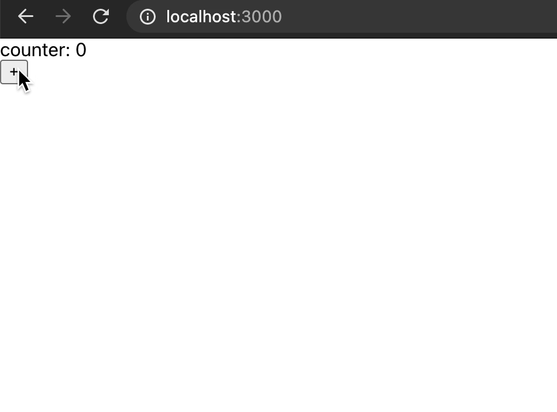
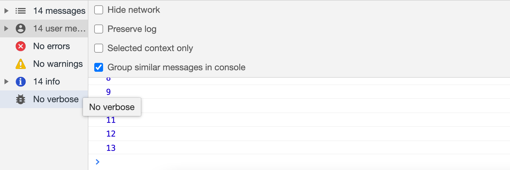
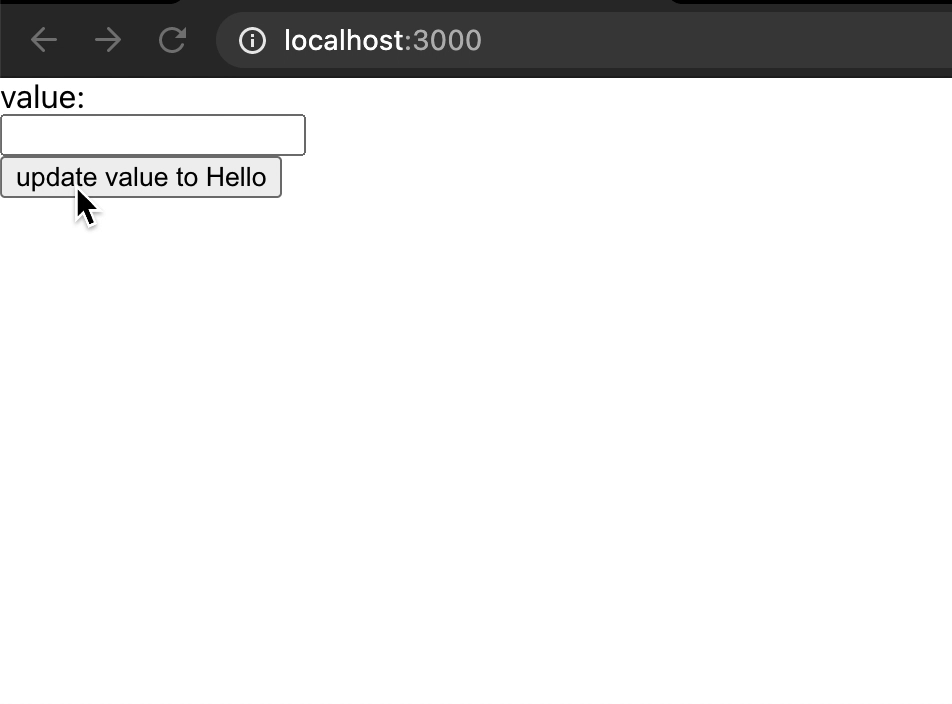
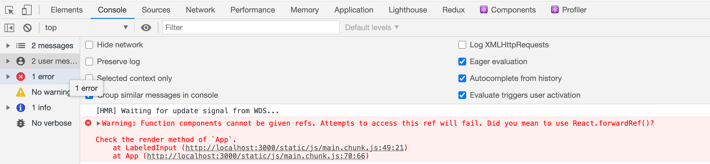
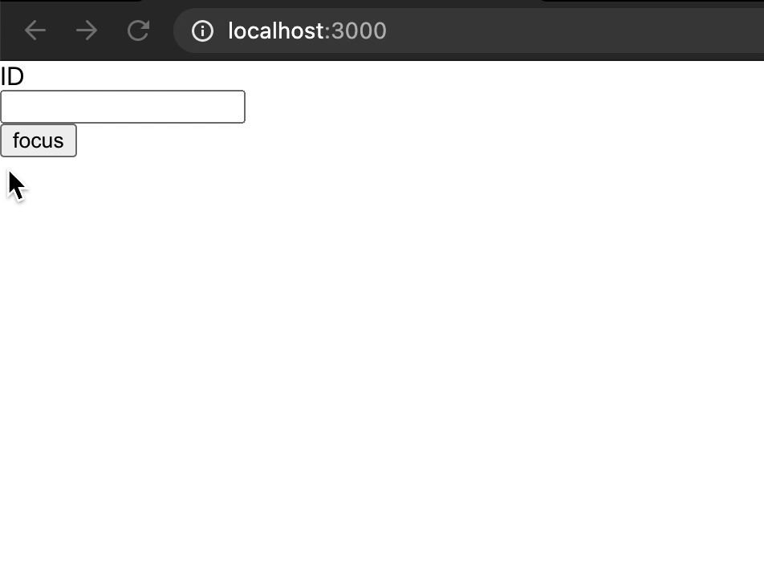

# React Ref에 대해 자세히 알아보자.

전체글 블로그에서 보기 -> https://toycrane.medium.com/react-ref%EC%97%90-%EB%8C%80%ED%95%B4-%EC%9E%90%EC%84%B8%ED%9E%88-%EC%95%8C%EC%95%84%EB%B3%B4%EC%9E%90-f7d18d140716

## TL;DR (간단 요약)

- ref는 컴포넌트 라이플 사이클 내에서 유지가 되며, 변경이 가능한 변수이며, 값이 변할 때 렌더링이 되지 않는다.
- ref는 주로 dom element에 접근하여 컴포넌트 전체 렌더링과 관계 없는 작업을 할 때 유용하게 사용한다.
- 부모 컴포넌트에서 자식 컴포넌트로 ref를 내려줄 때는 forwardRef를 활용하여야 한다.

## Ref에 대한 오해와 진실

`React`에서 `Ref`를 배우다보면, `Ref`는 `DOM Element`에 접근할 때만 사용하는 생각하는 분들이 많은 것 같습니다. 그래서 오늘은 `Ref`에 대해서 오해를 풀어 보는 시간을 가져보도록 하겠습니다.

`Ref`는 간단히 말해 컴포넌트 라이프 사이클(마운트와 언마운트) 내에서 유지되는 변경이 가능한 변수이며, 변수가 변할 때 렌더링이 추가로 되지 않습니다. 비슷한 것을 어디서 많이 보지 않으셨나요?

그렇습니다. `state`는 컴포넌트 라이프 사이클 내에서 유지 되는 변경이 가능한 변수이지만, `state`가 변할 때는 렌더링이 발생합니다.

다시 `state`와 `ref`를 정리하면

- state
  - 컴포넌트 라이프 사이클 내에서 유지가 되며, 변경이 가능한 변수
  - 값이 변할 때 렌더링이 다시 된다.
- ref
  - 컴포넌트 라이플 사이클 내에서 유지가 되며, 변경이 가능한 변수
  - 값이 변할 때 렌더링이 되지 않는다.

### ref로 만든 Counter 예제

```jsx
import { useRef } from "react";

function App() {
	const count = useRef(0);
	const handleClick = () => {
		count.current = count.current + 1;
		console.log(count.current);
	};

	return (
		<div>
			<div>counter: {count.current}</div>
			<button onClick={handleClick}>+</button>
		</div>
	);
}

export default App;
```





위 코드를 실행하고, 위와 같이 버튼을 아무리 클릭해봐도 `counter` 값이 변화가 없는 것을 알 수 있습니다.

이유는 `ref`의 값이 변할지 언정.. 렌더링이 다시 되지 않기 때문입니다. 반면 콘솔창에서는 `console.log`로 찍은 `counter` 값은 계속 업데이트되고 있는 것을 알 수 있습니다.

### state로 만든 counter

```jsx
import { useState } from "react";

function App() {
	const [count, setCount] = useState(0);
	const handleClick = () => {
		setCount(count + 1);
	};

	return (
		<div>
			<div>counter: {count}</div>
			<button onClick={handleClick}>+</button>
		</div>
	);
}

export default App;
```


위 코드를 실행하고, 위와 같이 버튼을 마구 클릭하면 클릭할 때마다 counter state가 변경되고, 이에 따라 렌더링이 다시 됩니다. 이에 따라 자연스레 화면에는 가장 최신의 counter 값이 렌더링 되는 것을 알 수 있습니다.

## Ref는 언제 쓰는게 맞을까?

ref의 개념은 확실히 안 것 같은데, 이걸 어디에 써야 할까요?

### DOM element에 접근하기

가장 많이 쓰이는 예시, 즉 글 서두에서 이야기했던 케이스입니다. ref를 활용하면 전체 컴포넌트를 렌더링 시키지 않고, `dom`에만 접근하여 내가 원하는 효과를 주는게 가능해 집니다.

예시 코드로 보면서 설명해 보도록 하겠습니다.

```jsx
import { useRef } from "react";

function App() {
	const iE = useRef();
	const handleClick = () => {
		iE.current.value = "Hello";
	};

	return (
		<div>
			<div>value: {iE.value}</div>
			<div>
				{/* iE에 input element를 저장함 */}
				<input ref={iE}></input>
			</div>
			<button onClick={handleClick}>update value to Hello</button>
		</div>
	);
}

export default App;
```

위 코드는 `input element`에 `ref`를 연결해주었고, 버튼을 클릭할 때마다 `input element`의 `value`를 변경해 주도록 하였습니다. 그리고 `<div>value: {iE.value}</div>` 를 통해 현재 `input element` 의 `value` 값을 렌더링하도록 해주었습니다.

실행해 보도록 하겠습니다.



버튼을 클릭하면 `input` 창의 `value` 값이 변경되어 `input` 창 내부에 `Hello`가 찍히는 것을 알 수 있지만, ref를 사용하여 렌더링이 다시 되지 않으므로 `value:` 으로 나오는 것을 알 수 있습니다.

즉, `dom element`에 접근하여 원하는 작업을 하였지만 컴포넌트 전체에 영향을 끼치지 않고, 원하는 작업을 할 수 있게 됩니다. 그래서 주로 `focus`나 텍스트를 선택할 때 주로 많이 사용하게 됩니다.

## Ref를 사용할 때 주의사항

### forwardRef

`Label`이 포함된 `Input` 컴포넌트를 만들고, `App` 컴포넌트에서 `ref`를 내려주는 코드를 만들어 보도록 하겠습니다.

```jsx
import { useRef } from "react";

const LabeledInput = (props) => (
	<div>
		<div>{props.label}</div>
		<input ref={props.ref}></input>
	</div>
);

function App() {
	const iE = useRef();
	const handleClick = () => iE.current.focus();
	return (
		<div>
			<LabeledInput label="ID" ref={iE}></LabeledInput>
			<button onClick={handleClick}>focus</button>
		</div>
	);
}

export default App;
```

실행해 보도록 하겠습니다.



함수형 컴포넌트에서 `ref`를 넘겨줄 때는 `forwardRef` 라는 문법을 사용하라고 에러 메시지를 띄어 주고 있습니다. 이유는 모든 `React` 컴포넌트는 기본적으로 `ref props`를 가지고 있는데, 그것과 겹치게 되므로 다른 방식으로 사용하라고 에러를 띄어 주고 있습니다.

`React`가 원하는 방식대로 `forwardRef`를 사용하여 코드를 변경해 보도록 하겠습니다.

```jsx
import { useRef, forwardRef } from "react";

const LabeledInput = forwardRef((props, ref) => (
	<div>
		<div>{props.label}</div>
		<input ref={ref}></input>
	</div>
));

function App() {
	const iE = useRef();
	const handleClick = () => iE.current.focus();
	return (
		<div>
			<LabeledInput label="ID" ref={iE}></LabeledInput>
			<button onClick={handleClick}>focus</button>
		</div>
	);
}

export default App;
```



정상적으로 작동하는 것을 알 수 있습니다 👏👏👏

### ref를 업데이트 시, 주의사항

ref의 값을 업데이트 하는 것은 side Effect이므로, 컴포넌트의 렌더링을 방해해선 안됩니다. 그러므로 반드시 컴포넌트가 마운트 되고 난 직후 (useEffect) 내에서 쓰거나 이벤트가 발생할 때 실행 (event handler) 안에서만 업데이트가 발생하도록 코드를 작성하여야 합니다.

이상으로 ref에 대한 오해와 진실을 알아보았습니다.

수정할 내용이 있거나, 잘못된 사실이 있다면 언제든 댓글로 알려주세요

이 블로그 글은 Code Pot, 리액트 챌린지의 과제로 작성되었습니다.

Code Pot, 리액트 챌린지가 궁금하다면? ⇒ [링크](https://www.notion.so/Code-Pot-React-2-a299e9ab5e4c4b97ae59028a90db9720)

## 참고 자료

[https://medium.com/humanscape-tech/react-usestate-vs-useref-4c20713f7ef](https://medium.com/humanscape-tech/react-usestate-vs-useref-4c20713f7ef)

[https://medium.com/frontend-digest/6-practical-applications-for-useref-2f5414f4ac68](https://medium.com/frontend-digest/6-practical-applications-for-useref-2f5414f4ac68)

[https://medium.com/trabe/react-useref-hook-b6c9d39e2022](https://medium.com/trabe/react-useref-hook-b6c9d39e2022)
