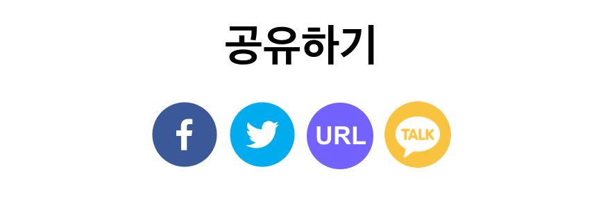
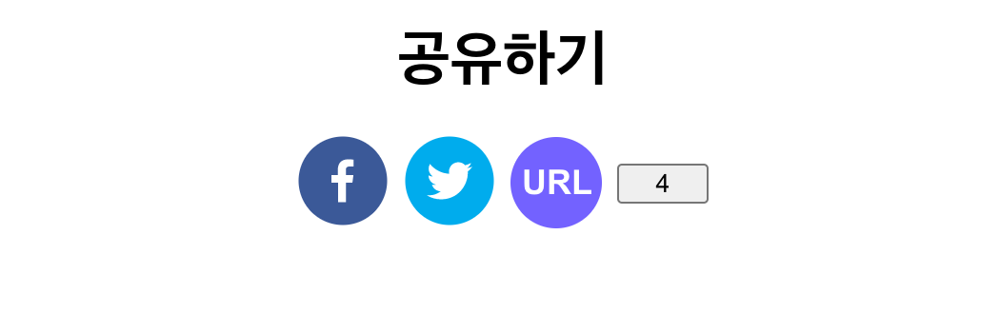
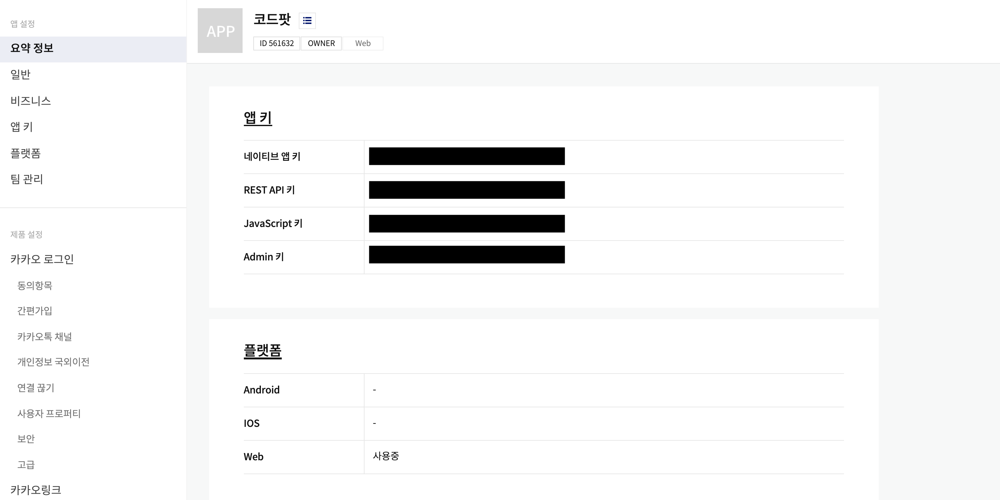
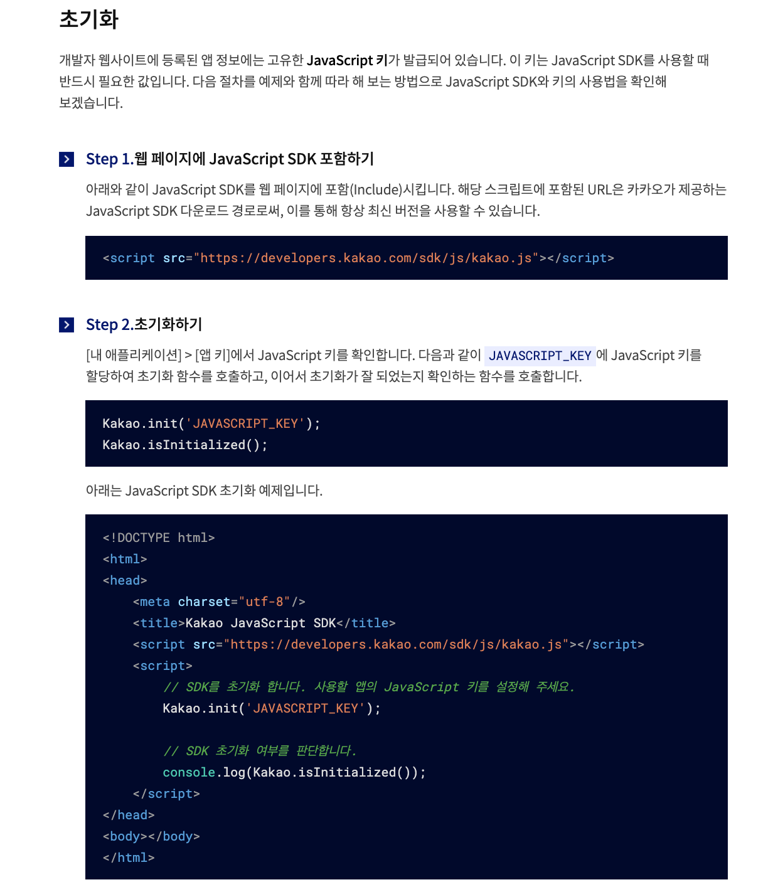
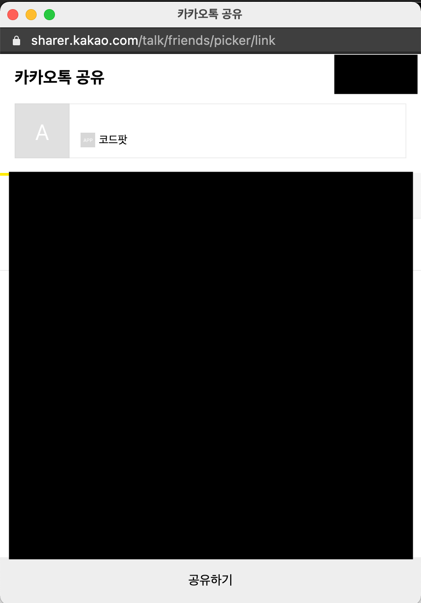
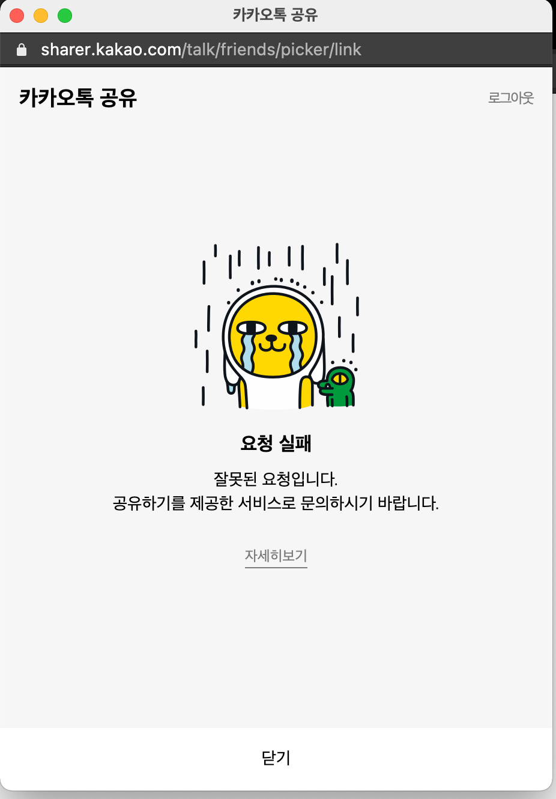
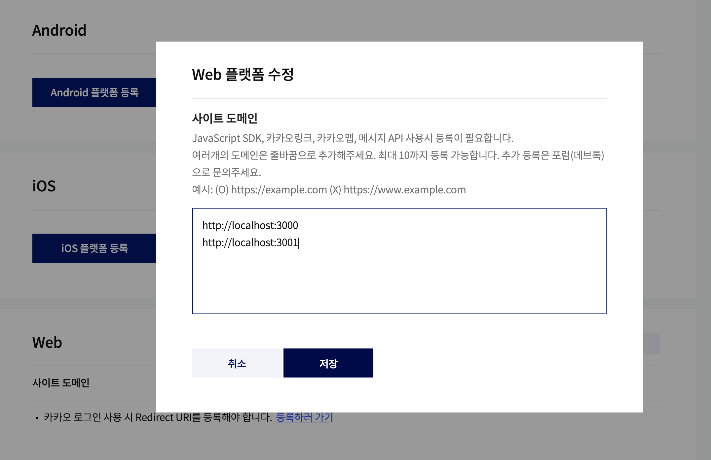

# Social 공유 버튼 만들기

전체 글은 아래 링크에서 보실 수 있습니다.
https://toycrane.medium.com/social-%EA%B3%B5%EC%9C%A0-%EB%B2%84%ED%8A%BC-%EB%A7%8C%EB%93%A4%EA%B8%B0-11563e54af82



이번 포스팅에서는 가장 많이 사용하는 공유 버튼 4가지를 만들어 보도록 하겠습니다.

## Button Container 만들기

우선 버튼이 위치할 컨테이너를 만들도록 하겠습니다.

`styled-component`를 사용할 예정이므로, `styled-component`를 설치합니다.

```jsx
yarn add styled-component
```

아래와 같이 버튼을 감쌀 컨테이너 코드를 작성해 줍니다.

```jsx
//App.js
import styled from "styled-components";

// 제목과 버튼을 감싸는 컨테이너
const FlexContainer = styled.div`
	display: flex;
	flex-direction: column;
	align-items: center;
`;

// 버튼을 배치시키는 컨테이너
const GridContainer = styled.div`
	display: grid;
	grid-template-columns: repeat(4, 48px);
	grid-column-gap: 8px;
	justify-content: center;
	align-items: center;
	margin-bottom: 16px;
`;

function App() {
	return (
		<FlexContainer>
			<h1>공유하기</h1>
			<GridContainer>
				<button>1</button>
				<button>2</button>
				<button>3</button>
				<button>4</button>
			</GridContainer>
		</FlexContainer>
	);
}

export default App;
```

Flex와 Grid 문법을 조합하여 사용하였으며, Flex와 Grid에 대해서 궁금하시다면 아래 링크를 참조해 주세요.

7분만에 알아보는 CSS flexbox → ([링크](https://toycrane.medium.com/7%EB%B6%84%EB%A7%8C%EC%97%90-%EC%95%8C%EC%95%84%EB%B3%B4%EB%8A%94-css-flexbox-32116f443af4))

7분만에 알아보는 CSS Grid → ([링크](https://toycrane.medium.com/7%EB%B6%84%EB%A7%8C%EC%97%90-%EC%95%8C%EC%95%84%EB%B3%B4%EB%8A%94-css-grid-41b11d4849))

코드를 실행해보면 아래와 같이 렌더링이 되는 것을 알 수 있습니다.


## Facebook, Twitter 공유 버튼 만들기

페이스북과 트위터 공유 버튼을 만드는 것은 `react-share` 라이브러리가 있어 빠르고, 편리하게 작성할 수 있습니다.

우선 `react-share` 라이브러리부터 설치해 보도록 하겠습니다. (라이브러리 github [링크](https://github.com/nygardk/react-share))

```jsx
yarn add react-share
```

`github` 상세 설명을 읽어보면, 아래와 같이 적혀 있습니다.


모든 컴포넌트의 필수 값으로 `children`(자식 컴포넌트)와 `url`을 넣어주어야 한다고 합니다. 그리고 좀 더 아래쪽으로 내려가보면 `Icon` 컴포넌트까지 제공하는 것을 알 수 있습니다.


아이콘의 `size`와 `round` 여부, `radius`까지 손쉽게 활용이 가능합니다.

`Facebook`, `Twitter` 공유 버튼을 추가해 보도록 하겠습니다.

아래와 같이 코드를 변경해 주세요.

```jsx
// App.js
...
import {
	FacebookShareButton,
	FacebookIcon,
	TwitterIcon,
	TwitterShareButton,
} from "react-share";
...

function App() {
  // window 객체에서 현재 url 가져오기
	const currentUrl = window.location.href;
	return (
		<FlexContainer>
			<h1>공유하기</h1>
			<GridContainer>
				<FacebookShareButton url={currentUrl}>
					<FacebookIcon size={48} round={true} borderRadius={24}></FacebookIcon>
				</FacebookShareButton>
				<TwitterShareButton url={currentUrl}>
					<TwitterIcon size={48} round={true} borderRadius={24}></TwitterIcon>
				</TwitterShareButton>
				<button>3</button>
				<button>4</button>
			</GridContainer>
		</FlexContainer>
	);
}

export default App;
```

코드를 실행해 보도록 하겠습니다.


이쁘게 페이스북과 트위터 버튼이 추가된 것을 알 수 있습니다.

## 현재 URL 복사 버튼 만들기

현재 URL 복사 버튼도 `react-copy-to-clipboard` 라이브러리를 활용하면 쉽게 만들 수 있습니다.

우선 라이브러리를 설치해 보도록 하겠습니다. (라이브러리 github [링크](https://github.com/nkbt/react-copy-to-clipboard))

```jsx
yarn add react-copy-to-clipboard
```

`github readMe`를 읽어보니, 아래와 같이 `CopyToClipBoard props`에 복사할 값을 넣어주고, `CopyToClipBoard` 컴포넌트로 우리의 버튼 컴포넌트를 감싸주면 된다고 합니다.


사용방법을 익혔으니, URL 복사 버튼을 만들어 보도록 하겠습니다.

```jsx
// App.js
...
import { CopyToClipboard } from "react-copy-to-clipboard";
...

// Style을 적용한 버튼 컴포넌트 추가
const URLShareButton = styled.button`
	width: 48px;
	height: 48px;
	color: white;
	border-radius: 24px;
	border: 0px;
	font-weight: 800;
	font-size: 18px;
	cursor: pointer;
	background-color: #7362ff;
	&:hover {
		background-color: #a99fee;
	}
`;

function App() {
	// window 객체에서 현재 url 가져오기
	const currentUrl = window.location.href;
	return (
		<FlexContainer>
			<h1>공유하기</h1>
			<GridContainer>
				...
				<CopyToClipboard text={currentUrl}>
					<URLShareButton>URL</URLShareButton>
				</CopyToClipboard>
				...
			</GridContainer>
		</FlexContainer>
	);
}

export default App;
```

코드를 실행해 보도록 하겠습니다.



이쁘게 URL 공유 버튼이 추가된 것을 알 수 있습니다.

## 카카오 공유 버튼 만들기

이제 마지막으로 카카오 공유버튼을 만들어 보도록 하겠습니다. 카카오 공유버튼은 아쉽게도 라이브러리가 없어 직접 kakao SDK를 불러와서 활용해야 합니다.

우선 아래 링크로 이동하여, 카카오 API Key 발급이 필요합니다. [링크](https://developers.kakao.com/docs/latest/ko/getting-started/app)로 이동하여 아래와 같은 key를 발급받아 주세요.



여기서 JavaScript 키를 사용할 예정이니 따로 복사 해주세요.

카카오의 경우, 아래 사진처럼 `javascript SDK`를 사용해야 합니다. 즉, `html` 내에서 `script` 태그를 통해서 카카오의 `javascript` 파일을 불러오고, `kakao SDK`를 통해 버튼을 컨트롤해야 합니다.



`React`에서 `html`에 `script`를 넣는 방법을 직접 구현할 수 있지만, 이 것 또한 많은 사람들이 고민해 놓은 과제이므로 [usehooks](https://usehooks.com/useScript/) 사이트에서 다른 사람들이 만들어 놓은 `hooks`를 사용해 보도록 하겠습니다.

`useScript`의 기능은 `src`에 해당하는 `script`를 불러오고, `script`의 상태를 결과 값으로 내려주는 `hooks`입니다. 이렇게 사용하는 이유는 `script`를 비동기로 불러오기 때문에 `script`가 다 불러왔을 때 우리가 원하는 작업들을 하기 위함입니다.

`src` 아래 `hooks.js` 파일을 하나 만들고, 아래 코드를 붙여넣기 해줍니다.

```jsx
// hooks.js
import { useState, useEffect } from "react";

function useScript(src) {
	// Keep track of script status ("idle", "loading", "ready", "error")
	const [status, setStatus] = useState(src ? "loading" : "idle");

	useEffect(
		() => {
			// Allow falsy src value if waiting on other data needed for
			// constructing the script URL passed to this hook.
			if (!src) {
				setStatus("idle");
				return;
			}

			// Fetch existing script element by src
			// It may have been added by another intance of this hook
			let script = document.querySelector(`script[src="${src}"]`);

			if (!script) {
				// Create script
				script = document.createElement("script");
				script.src = src;
				script.async = true;
				script.setAttribute("data-status", "loading");
				// Add script to document body
				document.body.appendChild(script);

				// Store status in attribute on script
				// This can be read by other instances of this hook
				const setAttributeFromEvent = (event) => {
					script.setAttribute(
						"data-status",
						event.type === "load" ? "ready" : "error"
					);
				};

				script.addEventListener("load", setAttributeFromEvent);
				script.addEventListener("error", setAttributeFromEvent);
			} else {
				// Grab existing script status from attribute and set to state.
				setStatus(script.getAttribute("data-status"));
			}

			// Script event handler to update status in state
			// Note: Even if the script already exists we still need to add
			// event handlers to update the state for *this* hook instance.
			const setStateFromEvent = (event) => {
				setStatus(event.type === "load" ? "ready" : "error");
			};

			// Add event listeners
			script.addEventListener("load", setStateFromEvent);
			script.addEventListener("error", setStateFromEvent);

			// Remove event listeners on cleanup
			return () => {
				if (script) {
					script.removeEventListener("load", setStateFromEvent);
					script.removeEventListener("error", setStateFromEvent);
				}
			};
		},
		[src] // Only re-run effect if script src changes
	);

	return status;
}

export { useScript };
```

그리고 App 컴포넌트에서 useScript hooks를 import하여, kakao SDK를 초기화 해보도록 하겠습니다.

```jsx
// App.js
....
import { useScript } from "./hooks";
import { useEffect } from "react";
...

function App() {
	...
	// kakao SDK import하기
	const status = useScript("https://developers.kakao.com/sdk/js/kakao.js");

	// kakao sdk 초기화하기
	// status가 변경될 때마다 실행되며, status가 ready일 때 초기화를 시도합니다.
	useEffect(() => {
		if (status === "ready" && window.Kakao) {
			// 중복 initialization 방지
			if (!window.Kakao.isInitialized()) {
				// 두번째 step 에서 가져온 javascript key 를 이용하여 initialize
				window.Kakao.init("발급받은 javascript key");
			}
		}
	}, [status]);
	...
}

export default App;
```

`useEffect`를 활용하여, 최초 렌더링이 끝나고 나서 `script`의 `import` 상태를 확인한 후 초기화를 진행해 주었습니다. `useEffect`를 활용한 이유는 `kakao SDK`를 `import`하는 작업이 `App` 컴포넌트의 렌더링을 방해하면 안되므로, `useEffect`에서 `side Effect`로 처리해 주었습니다

초기화를 마쳤으니, 카카오 공유 버튼 핸들러를 추가해 보도록 하겠습니다.

```jsx
// App.js
function App() {
	...
	const handleKakaoButton = () => {
        window.Kakao.Link.sendScrap({
            requestUrl: currentUrl,
        });
    };
	...
	return (
				...
					<button onClick={handleKakaoButton}>4</button>
				...
	);
}
```

위와 같이 `handleKakaoButton` 함수를 추가하여 주고, 버튼 `click event`에 바인딩해주었습니다.

저의 경우, `kakao` 링크에서 제공하는 `sendScrap` 기능을 사용하였는데, 이 외에도 다양한 기능이 많으니 살펴보시고 상황에 맞는 기능을 사용하면 될 것 같습니다. (kakao 기능 명세서 [링크](https://developers.kakao.com/docs/latest/ko/message/js#create-message))

다시 실행하고, 버튼을 클릭해 보도록 하겠습니다.



위와 같이 공유하기가 버튼이 나오는 것을 알 수 있습니다.



만약에 아래와 같은 페이지가 뜬다면, 아래와 같이 카카오 어플리케이션 등록에서 [localhost](http://localhost) 넣는 것을 깜빡하신 것이니 주의해주세요.



마지막으로 `Kakao` 버튼을 꾸며보도록 하겠습니다.

우선 아래 `kakao` 로고 이미지를 다운 받아 `src` 폴더 밑에 추가해 주세요.


그리고 아래와 같이 `Kakao Button`을 만들어 줍니다.

```jsx
// App.js
...
import kakaoLogo from "./kakao.png";
...
const KakaoShareButton = styled.a`
	cursor: pointer;
`;

const KakaoIcon = styled.img`
	width: 48px;
	height: 48px;
	border-radius: 24px;
`;
...

function App() {
	...
	return (
				...
				<KakaoShareButton onClick={handleKakaoButton}>
					<KakaoIcon src={kakaoLogo}></KakaoIcon>
				</KakaoShareButton>
				...
	);
}
```

코드를 실행해 보도록 하겠습니다.


위와 같이 4가지 버튼이 이쁘게 모두 만들어 진 것을 알 수 있습니다. 👏👏👏


이 블로그 글은 Code Pot, 리액트 챌린지의 과제로 작성되었습니다.

Code Pot, 리액트 챌린지가 궁금하다면? ⇒ [링크](https://www.notion.so/Code-Pot-React-2-a299e9ab5e4c4b97ae59028a90db9720)

## 전체 코드

([github 링크](https://github.com/toy-crane/place-holder-loading))에서 전체 코드를 확인 하실 수 있습니다.
