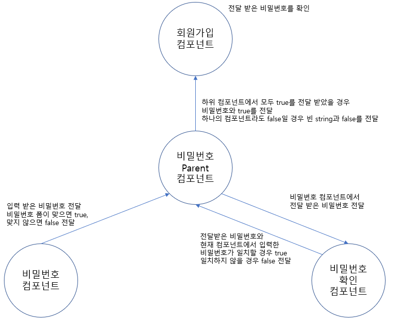

# 1주차

### useEffect와 React Lifecycle
 - React에서의 컴포넌트는 클래스 컴포넌트, 함수 컴포넌트로 나눌 수 있습니다.
 - 둘의 차이는 Lifecycle method를 사용할 수 있냐 없냐 입니다.
 - 과거 함수 컴포넌트에서는 Lifecycle method를 사용할 수 없었지만, 현재 useEffect hook을 이용하여 함수 컴포넌트에서도 Lifecycle method의 기능을 비슷하게 구현할 수 있게 되었습니다.

 ### Lifecycle
 - Lifcecycle은 크게 3가지로 나뉩니다.
 - 화면에 생성되는 Mounting
 - 업데이트되는 Updating
 - 화면에서 사라지는 Unmount
 - Lifecycle method는 클래스 컴포넌트에서만 사용합니다.

### useEffect
 - useEffect hook을 이용하여 함수 컴포넌트에서도 Mounting, Updating, Unmount를 할 수 있습니다.
 ```tsx
 useEffect(() => {
     /* 
        1. Mounting 
        2. Updating 
    */
     return () => {
         /* 3. Unmount */
     }
 }, [/* dependency 배열 */]);
 ```
 1. 컴포넌트가 화면에 나타날 때(Mounting)의 코드를 작성합니다.
 2. 컴포넌트가 업데이트 될 때의 코드를 작성합니다, dependency 배열에 업데이트 되는 상태를 작성합니다. ( *dependency배열에 상태, props 등을 작성하는 것이 규칙이며, 작성하지 않을 경우 상태가 업데이터 되야될 때 의도대로 작동하지 않을 수 있습니다.)
 3. 컴포넌트가 화면에서 사라질 때(UnMount)의 코드를 작성합니다.

### useEffect의 dependency를 다루며 겪은 문제
 - React로 회다원가입 시나리오를 구현해 볼 때 useEffect의 dependency에 Props로 받아온 함수를 설정하였을 경우에 대한 이슈가 있었습니다.
 - 회원가입 시나리오에서 컴포넌트 구성을 다음과 같은 형태로 진행 하였습니.
 - 부모컴포넌트 : 회원가입 컴포넌트
 - 자식컴포넌트 : 이메일 입력 컴포넌트, 닉네임입력 컴포넌트, 비밀번호 입력 컴포넌트, 비밀번호 확인 컴포넌트
 - 이슈가 있었던 부분은 비밀번호관련 컴포넌트 입니다.

 - 위의 사진과 같이 컴포넌트를 구성하였습니다.
 - 사용자가 비밀번호를 입력할때마다 실시간으로 경고문을 업데이트 하기 위해 비밀번호, 비밀번호확인 컴포넌트간 데이터 교환이 필요했고 비밀번호 Parent컴포넌트에서 각 두 컴포넌트에서 데이터를 송수신 하도록 구성하였습니다.
 - 비밀번호 Parent에서는 children컴포넌트에 함수를 넘겨주고 children컴포넌트는 인자로 비밀번호를 넣어서 실행시키면 다시 Parent컴포넌트에서 데이터를 전달받을 수 있도록 의도하였습니다.
 ```tsx
    const getPassword = useCallback((data : string, success : boolean) => {
        setPassword(data);
        setDataConfirm({
            ...dataConfirm,
            password : success
        });
    }, [password, dataConfirm]);
 ```
 - 위의 코드는 Parent컴포넌트에 위치하며 children컴포넌트로 props로 전달할 함수입니다.
 ```tsx
     useEffect(() => {
        if(onfocus){
            if(!ConfirmPasswordForm(password)){
                setDatacheck(false);
                setWarn("🙁 비밀번호양식은 8~25자리 숫자, 영문자 혼합입니다.");                
                passwordData(password, false);
            }else{
                setDatacheck(true);
                setWarn("🙂 비밀번호 입력 완료 되었습니다.");
                passwordData(password, true);
            }
        }
    }, [password, onfocus, dataCheck, passwordData]);
 ```
 - 위의 코드는 children컴포넌트에 위치하며 passwordData함수는 상위컴포넌트로 비밀번호를 전달하기위해 Props로 받은 함수입니다.
 - deps에 passwordData함수를 입력해 놓으면 Rerendering이 무한반복되는 현상이 있었습니다.
 - 무한반복 현상에 대한 현상은 다음과 같았습니다.
 1. 자식 컴포넌트에서 passwordData 함수가 생성되고 실행됨.
 2. 부모 컴포넌트에서는 passwordData함수의 실행 결과를 받아 상태를 갱신함.
 3. 부모 컴포넌트에서 상태가 갱신되었으므로 Rerendering
 4. Rerendering이 진행되며 자식 컴포넌트의 상태 확인 (useEffect내의 deps에서 이전의 상태와 현재의 상태가 같은지 비교, 바뀐 상태가 있다면 Rerendering)
 5. 자식 컴포넌트에서는 이전의 passwordData함수와 현재의 passwordData함수가 다른것으로 인식. (여기서 passwordData함수는 새로 생성되며, Rerendering되기 전의 passwordData함수와는 다른 것으로 인식)
 6. passwordData함수가 이전에 실행했던 passwordData 함수와 다른것으로 인식하였으므로 자식 컴포넌트를 Rerendering 및 함수 실행
 7. 1 ~ 6 동작 반복
 - 데이터가 바뀌지 않는데 왜 상태가 갱신되는지에 대한 의문은 아래의 링크를 참고하여 예측했으며, 부모 컴포넌트를 아래의 코드와 같이 수정하였습니다.<br/>
 참고1 : https://stackoverflow.com/questions/62464488/how-to-use-a-prop-function-inside-of-useeffect<br/>
 참고2 : https://stackoverflow.com/questions/61255053/react-usecallback-with-parameter
 ```tsx
    const getPassword = useCallback((data : string, success : boolean) => {
        if(password !== data) setPassword(data);
        if(dataConfirm.password !== success)
            setDataConfirm({
                ...dataConfirm,
                password : success
            });
    }, [password, dataConfirm]);
 ```
 - if(password !== data){}와 같이 조건문을 추가하여 parameter의 데이터와 현재 컴포넌트의 상태가 다를 경우에만 컴포넌트 상태를 갱신하도록 수정하였습니다.
 - 결과는 성공적으로 해결이 되었습니다.