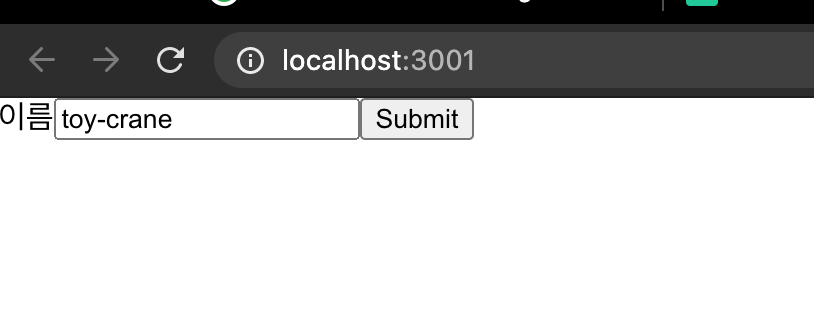
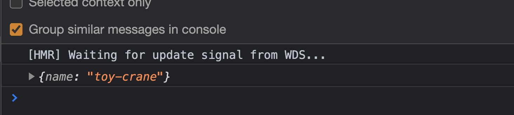
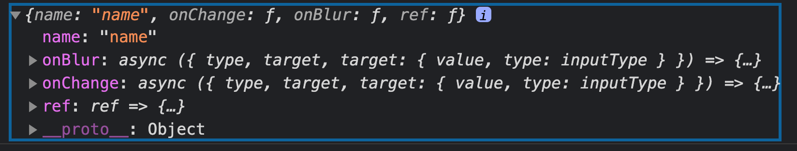
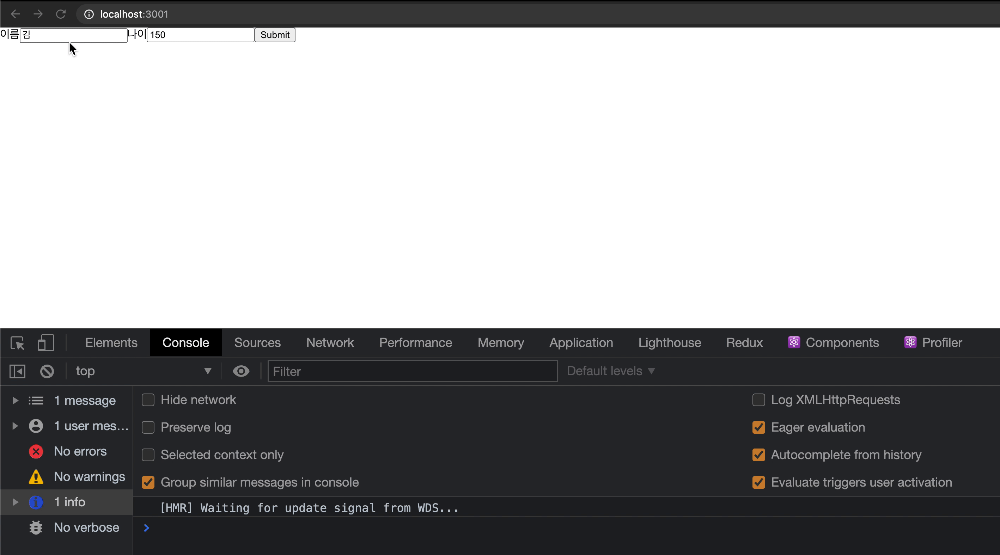
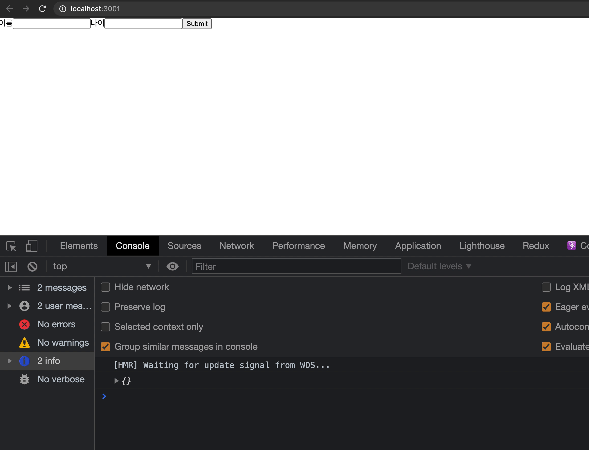
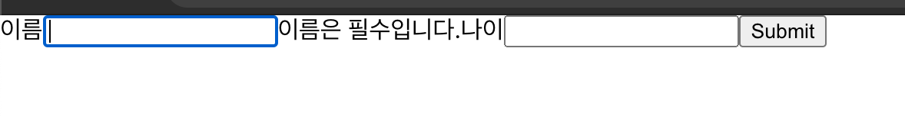
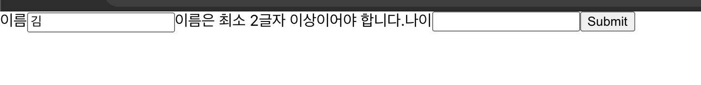
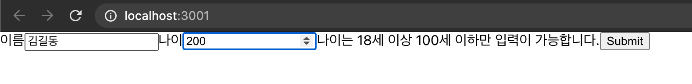

# React에서 form 쉽게 다루기

feat. React Hooks form

이번 포스팅에서는 React hooks form을 활용하여 React에서 form을 다루는 방법을 알아보도록 하겠습니다.

React에는 React hooks form 이외에도 다양한 formik, redux-form 등이 있지만 React hooks form이 다른 라이브러리들에 비해 성능도 좋고, 패키지 사이즈가 작습니다. 뿐만 아니라 React의 hooks를 통해서 기존에 존재하는 form들과 결합이 쉬워 사용하기가 편리합니다.

# React Hook form 설치하기

```jsx
// react 설치하기
npx create-reat-app react-hook-example

// react 설치 디렉토리로 이동
cd react-hook-example

// 패키지 설치하기
yarn add react-hook-form
```

# 간단한 form 만들기

React hook form을 활용하여 이름을 받는 간단한 form을 하나 만들어 보도록 하겠습니다.

```jsx
// App.js
import { useForm } from "react-hook-form";

function App() {
	const { register, handleSubmit } = useForm();
	const onSubmit = (data) => console.log(data);

	return (
		<form onSubmit={handleSubmit(onSubmit)}>
			<label>이름</label>
			<input {...register("name")} />
			<input type="submit" />
		</form>
	);
}

export default App;
```

useForm hooks를 실행하면 위와 같이 `register`,`handleSubmit` 함수를 return 해줍니다.

```jsx
<input {...register("input_name")} />
```

우선 register 함수는 위와 같은 형태로 추가하여 줍니다.

```jsx
<form onSubmit={handleSubmit(onSubmit)}>
```

그리고 submit을 핸들링할 `onSubmit` 함수를 `handleSubmit` 함수로 감싸 `form`의 `onSubmit` 어트리뷰트에 연결시켜 줍니다.

위 코드를 실행해 보도록 하겠습니다.



위와 같이 `input` 창이 렌더링이 되고, 이름을 입력한 후 `Submit`을 클릭하면 아래와 같이 우리가 의도한 대로 `input` 창에 입력된 값이 콘솔창에 출력 되는 것을 알 수 있습니다.



간단하게 form을 만들어 보았으니, react-hook-form 원리에 대해서 알아보도록 하겠습니다.

## register 함수를 통해 필드 등록하기

register 함수는 React hook from의 가장 근간이 되는 함수입니다. 우리가 원하는 form에 register 함수를 통해 등록하면 react hooks from에서 validation과 submission에서 form을 통해 입력된 값들이 사용가능 합니다.

```jsx
<input {...register("field_name")} />
<select {...register("field_name")}>
...
```

그렇기 때문에 입력을 받고자 하는 모든 필드에는 반드시 register 함수를 사용해 주어야 합니다.

위와 같이 관리하고자 하는 form에 `{...register("field_name")}` 비구조 할당으로 넣어주어야 하는데, 이유는 아래와 같이 `register` 함수를 실행하면 `event controller`(OnClick, OnBlur) 와 더불어 `ref`에 맞는 함수를 자동으로 생성하여 주기 때문입니다.



즉, 이 생성된 함수들을 통해서 react-hook-form이 form의 변화를 감지하고, validation이나 submission이 가능하게 되는 것입니다.

## handleSubmit 함수를 통해 데이터 받기

validation이 정상적으로 완료된 데이터는 hadleSubmit 함수를 통해서 받을 수 있습니다.

```jsx
...
const onSubmit = (data) => console.log(data);
<form onSubmit={handleSubmit(onSubmit)}>
...
```

위와 같이 `onSubmit` 함수를 하나 작성합니다. 첫번째 인자로는 react-hook-form에 받을 object가 들어가며, 저는 `data`라고 이름을 지어주었습니다.

이렇게 되면 form이 submission이 되었을 때, `onSubmit` 함수를 통해서 값들을 받을 수 있습니다.


그러한 이유로 아래와 같이 예시에서 입력하였던  `toy-crane`이 나온 것을 알 수 있습니다

## validation 조건 추가하기

이제 validation 조건들을 하나씩 추가해도록 하겠습니다.

validation 조건은 `register` 함수의 두번째 인자로 들어가며, 기본적으로 사용할 수 있는 조건들은 아래와 같습니다.

- required (필수 여부), min (최소 값), max(최대값), minLength(최소 길이), maxLength(최대 길이), pattern(정규 표현식), validate (custom validation 함수)

```jsx
import { useForm } from "react-hook-form";

function App() {
	const { register, handleSubmit } = useForm();
	const onSubmit = (data) => console.log(data);

	return (
		<form onSubmit={handleSubmit(onSubmit)}>
			<label>이름</label>
			<input {...register("name", { required: true, minLength: 2 })} />
			<label>나이</label>
			<input type="number" {...register("age", { min: 18, max: 99 })} />
			<input type="submit" />
		</form>
	);
}

export default App;
```

예시를 위해 위와 같이 나이를 입력받는 form을 하나 추가하였습니다. 

위와 같이 입력하고 실행해 보도록 하겠습니다.



의도적으로 validation에 통과하지 못하도록 이름을 한글자와 나이를 100이 넘는 150으로 입력하였는데 validation을 통과하지 못해 콘솔창에 값이 찍히지 않은 것을 알 수 있습니다.

## validation error handling 하기

form에 validation 조건을 주어 form이 submit되지 못하도록 코드를 추가하였으니, 이제는 validation error가 발생할 때 유저에게 노출해 주는 방법을 알아보도록 하겠습니다.

```jsx
// App.js
import { useForm } from "react-hook-form";

function App() {
	const {
		register,
		formState: { errors },
		handleSubmit,
	} = useForm();
	const onSubmit = (data) => console.log(data);

	console.log(errors);

	return (
		<form onSubmit={handleSubmit(onSubmit)}>
			<label>이름</label>
			<input {...register("name", { required: true, minLength: 2 })} />
			<label>나이</label>
			<input type="number" {...register("age", { min: 18, max: 99 })} />
			<input type="submit" />
		</form>
	);
}

export default App;
```

`useForm`의 return 값에는 `formState`가 있고, `formState` 객체 안에는 `errors` 객체가 포함되어 있습니다.

잘못된 값을 입력하고 콘솔창에서 `errors`를 출력해 보도록 하겠습니다.



위와 같이 `errors` 객체 내에 각 `input`의 이름에 따라서 에러가 저장되어 있는 것을 알 수 있습니다.

이것을 활용하여 잘못된 입력을 하였을 때, 유저에게 알려줄 수 있도록 코드를 변경해 보도록 하겠습니다.

```jsx
import { useForm } from "react-hook-form";

function App() {
	...
	return (
		<form onSubmit={handleSubmit(onSubmit)}>
			<label>이름</label>
			<input {...register("name", { required: true, minLength: 2 })} />
			{errors.name?.type === "minLength" &&
				"이름은 최소 2글자 이상이어야 합니다."}
			{errors.name?.type === "required" && "이름은 필수입니다."}
			<label>나이</label>
			<input type="number" {...register("age", { min: 18, max: 99 })} />
			{errors.age && "나이는 18세 이상 100세 이하만 입력이 가능합니다."}
			<input type="submit" />
		</form>
	);
}

export default App;
```

위와 같이 코드를 변경하고 실행해 보도록 하겠습니다.







위 이미지처럼 입력된 상태에 따라서 우리가 원하는 메시지를 위와 같이 노출 할 수 있는 것을 알 수 있습니다.

CSS가 따로 구현되어있지 않아 어수선한데, 에러 메시지만 참고해 주세요.

# Wrap-up

이처럼 react-hook-form을 통해서 간단하게 form을 구현하는 방법을 알아 보았습니다. validation의 경우, 여러 군데에서 사용될 수 있기 때문에 schema-based form validation를 참조하셔서 모듈화 하는 방법도 있으니 보시면 좋을 것 같습니다. ([링크](https://react-hook-form.com/get-started#Handleerrors))

react-hook-form의 경우 한글로 번역이 잘되어 있기 때문에 한글 문서도 한 번씩 읽어보는 것도 추천드립니다. ([링크](https://react-hook-form.com/kr/get-started/))

- github에서 전체 코드 보기 ([링크](https://github.com/toy-crane/react-hook-form-example))


이 블로그 글은 Code Pot, 리액트 챌린지의 과제로 작성되었습니다.

Code Pot, 리액트 챌린지가 궁금하다면? ⇒ [링크](https://www.notion.so/Code-Pot-React-2-a299e9ab5e4c4b97ae59028a90db9720) 

# 참고 자료

- Validating React InputsWith React Hook Form ([링크](https://medium.com/swlh/validating-react-forms-with-react-hook-form-b30d6b2b111e))
- Build the Next Generation of Forms With React Hooks Forms ([링크](https://betterprogramming.pub/build-the-next-generation-of-forms-with-react-hooks-forms-b4f2039e51c1))