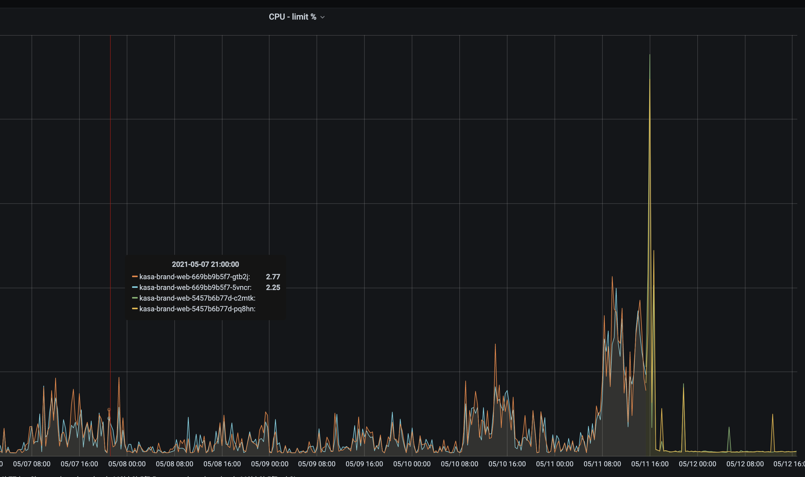

# next/image 사용해야할까?

Brand site를 개발하며 SEO를 높히기 위해 기존 Vue.js로 되어있는 프로젝트를 next.js 로 프레임워크를 변경하는 작업을 진행한 경험이 있습니다. 이때 새로운 프레임워크로 Next.js를 선택한 배경으로는 새로운 v10이 나왔기도 했고, 가장 인기있는 프레임워크 중 하나이기 때문입니다.

Next.js가 이번 v10이 나오게 되면서 많은 기능들이 추가 되었는데, 그 중 가장 관심이 갔던게 `next/image` 입니다.

```jsx
import Image from 'next/image'

function Home() {
  return (
    <>
      <h1>My Homepage</h1>
      <Image
        src="/me.png"
        alt="Picture of the author"
        width={500}
        height={500}
      />
      <p>Welcome to my homepage!</p>
    </>
  )
}

export default Home
```

`next/image`의 역할은 이미지 최적화로 `static HTML Export`를 제외한다면 모두 사용할 수 있습니다. (IE에서도 사용할 수 없습니다.)

`next/image`를 사용하면 브라우저에서 지원하는 경우 WebP와 같은 최신 형식의 이미지로 변환하여 전송하고, 이미지 크기를 조정하고 최적화할 수 있습니다. 이렇게 하면 viewPort가 더 작은 장치로 큰 이미지가 전송되는 것을 막을 수 있습니다. 

빌드시 이미지를 최적화하는 대신 user가 이미지를 요청할 때마다 최적화를 진행합니다. 이에 static site generators와 다르게 빌드타임이 증가하진 않습니다.

이미지는 요청에 따라 동적으로 최적화되고 `/cache/images` 디렉토리에 저장됩니다. 최적화 된 이미지 파일은 만료일에 도달 할 때까지 계속 제공됩니다. 캐시되었지만 만료 된 파일과 일치하는 요청이 생성되면 새 최적화 된 이미지를 생성하고 새 파일을 캐시하기 전에 캐시 된 파일이 삭제됩니다. 만료 (또는 Max Age)는 업스트림 서버의 Cache-Control 헤더에 의해 정의됩니다. Cache-Control에서 s-maxage가 발견되면 사용됩니다. s-maxage가 없으면 max-age가 사용됩니다. max-age가 없으면 60 초가 사용됩니다. 생성 가능한 총 이미지 수를 줄이기 위해 `deviceSizes` 및 `imageSizes`를 구성 할 수 있습니다.

```js
module.exports = {
  images: {
    deviceSizes: [640, 750, 828, 1080, 1200, 1920, 2048, 3840],
    imageSizes: [16, 32, 48, 64, 96, 128, 256, 384],
  },
}
```

## layout

이미지의 스타일과 레이아웃을 위해 `layout` 속성을 이용할 수 있는데 이 `layout` 속성에서 지원하지 않는 부분들이 너무 많았다. 그래서 v10이 나오고 나서도 `layout` 이 계속 추가되었습니다.

## memory leak

`next/image`에서 memory leak 문제가 지속적으로 제기 되었습니다. https://github.com/vercel/next.js/issues/20915
v9에서 v10으로 변경한 후 memory 사용량이 비정상적으로 높아졌으며 이로 인해 `next/image`의 image component를 제거해야만 했다 라는 말이 계속 나왔습니다.


이 문제는 `next/image` 내부적으로 사용하고 있는 [lovell/sharp](https://github.com/lovell/sharp/issues/1803) 라이브러리의 문제인 걸로 파악되었으나 아직 문제가 해결되지는 않은 상태입니다.

이 문제를 알게된 이유도 현재 next 서버를 돌리고 있는 ecs(Amazon Elastic Container Services)의 cpu와 memory의 사용량이 비정상적인 경우가 존재하였고, image가 pending 상태로 제대로 받아지지 않고 ecs가 비정상적으로 종료되는 문제가 계속 발생했기 때문입니다.

다음은 `next/image`를 사용했다가 제거한 후의 cpu, memory 사용량입니다. 5/11 15:30 에 제거한 후 배포를 했는데 확연한 차이를 확인할 수 있습니다.


## 마무리
현재 next.js의 stable version은 v10.2.0 입니다. canary 버전에서 버그가 수정되었다고는 하지만 실제로 이 버전을 다운받아 실행해본 결과 문제가 해결되지 않았었습니다..ㅠㅠ. v10에서 많은 좋은 기능들이 추가되었긴 하지만 memory 관련 이슈가 해결되기 전까지는 `next/image`를 사용하는 걸 지양해야할 것 같습니다.

### v10.2.1-canary.3(https://github.com/vercel/next.js/releases/tag/v10.2.1-canary.3)
@timneutkens timneutkens released this 9 days ago

Core Changes
- fix memory leak in require.cache: [#24282](https://github.com/vercel/next.js/pull/24282)
