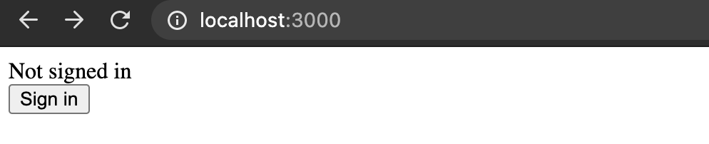
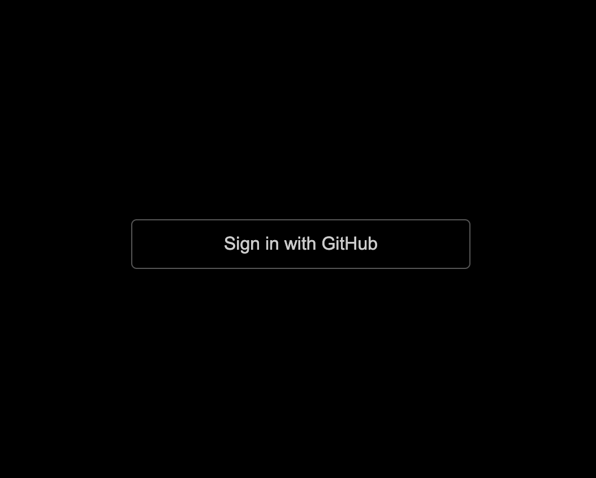
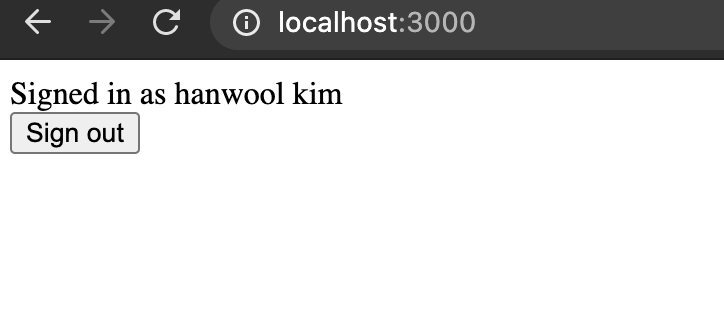

# 7분만에 Next Auth 알아보기

Next JS에서는 Next Auth라고 하여 Social 로그인을 쉽게 관리할 수 있는 라이브러리가 있습니다.

이번 블로그에서는 해당 라이브러리를 활용해서 빠르게 소셜 로그인을 빠르게 구현해 보도록 하겠습니다.

# 라이브러리 설치하기

```jsx
// next.js 설치하기
yarn create next-app next-auth-tutorial
// next auth 설치하기
yarn add next-auth
```

# Next Auth 설정하기

## 환경 변수 설정하기

```jsx
// .env
GITHUB_ID = 123123123123333
GITHUB_SECRET = abcdddd
NEXTAUTH_URL=http://localhost:3000
```

root 폴더 내 .env 파일에 github에서 받은 클라이언트 정보와 `NEXTAUTH_URL`을 입력합니다. `NEXTAUTH_URL`은 next.js가 실행될 URL을 의미합니다.

아직 소셜 로그인이 익숙하지 않아 클라이언트 정보를 어디서 발급 받아야하는지 모르시는 분들은 이 [링크](https://gist.github.com/ninanung/2ad24c760e81401ed65f13f634a25e73)를 참조하여 주세요.

## nextauth API 만들기

```jsx
// pages/api/auth/[...nextauth].js

import NextAuth from 'next-auth'
import Providers from 'next-auth/providers'

export default NextAuth({
  // Configure one or more authentication providers
  providers: [
    Providers.GitHub({
      clientId: process.env.GITHUB_ID,
      clientSecret: process.env.GITHUB_SECRET
    }),
    // ...add more providers here
  ],

  // A database is optional, but required to persist accounts in a database
  database: process.env.DATABASE_URL,
})
```

page 폴더 내에 `api/auth/[...nextauth].js` 파일을 하나 생성합니다. 이렇게 되면 `/api/auth/*` 의 경로로 요청되는 모든 request는 위 파일에서 handling이 가능하게 됩니다.

DB 연결은 지금은 필요 없으나, 다음 파트에서 DB에 저장하는 방법을 배울 예정이기 때문에 DB 설정이 하다는 것만 알아두고 넘어가도록 하겠습니다.

## next.js에 nextauth 연결하기

```jsx
import { Provider } from "next-auth/client";

function MyApp({ Component, pageProps }) {
	return (
		<Provider session={pageProps.session}>
			<Component {...pageProps} />
		</Provider>
	);
}
export default MyApp;
```

위와 같이 next-auth가 제공하는 `Provider`로 컴포넌트를 감싸 줌으로 인해 next.js 내 모든 컴포넌트에서 `useSession hooks`를 활용하여 session 정보에 접근할 수 있게 됩니다.

# 컴포넌트에 nextAuth 활용하기

```jsx
// index.js
import { signIn, signOut, useSession } from 'next-auth/client'

export default function Page() {
  const [ session, loading ] = useSession();

	if (loading) {
		return <div>loading...</div>;
	};

  return <>
    {!session && <>
      Not signed in <br/>
      <button onClick={() => signIn()}>Sign in</button>
    </>}
    {session && <>
      Signed in as {session.user.name} <br/>
      <button onClick={() => signOut()}>Sign out</button>
    </>}
  </>
} 
```

기존의 index.js 파일의 위와 같은 형태로 변경해 줍니다.

여기서 몇 가지만 자세히 알아보고 넘어가도록 하겠습니다.

**useSession Hooks**

로그인 여부를 알려주는 hooks으로 로그인 여부에 따라 배열의 첫번째 인자로 유저의 정보를 return 해줍니다. 그래서 위 코드에서는 session의 여부의 따라 로그인/로그아웃 버튼 여부를 노출하여 주었습니다.

배열의 두번째 인자로는 loading 정보가 담기는데, 현재 로그인 여부를 체크하고 있는지를 알 수 있습니다. 즉 loading 여부를 확인하여 loading bar와 같은 컴포넌트를 추가할 수 있습니다.

**signIn, signOut 함수**

signIn, signOut 함수는 next auth에서 제공해주는 함수로 해당 함수를 실행하면 next-auth가 만들어 놓은 로그인 페이지 혹은 로그아웃 페이지로 이동하게 됩니다. 편리하게 사용하게 하기 위해 만들어 놓은 것이지 수정이 가능합니다. ([링크](https://next-auth.js.org/configuration/pages))

이제 실행해 보도록 하겠습니다.

```jsx
yarn build && yarn start
```



최초에 실행하면 login 상태가 아니기 때문에 session 정보에 따라 Sign In 버튼을 노출시키게 됩니다.

Sign In 버튼을 클릭하면 아래와 같은 next-auth에서 생성한 페이지로 이동하게 됩니다.



Sign in with Github 버튼을 클릭하고, github 인증을 끝내면 아래와 같이 로그인한 유저의 이름과 함께 로그아웃 버튼이 생성되게 됩니다.



# Wrap-up

Next Auth를 활용하면 위와 같이 정말 빠르고, 간단하게 Social Oauth를 구현할 수 있습니다. 뿐만 아니라 다양한 Provider를 설정 하나만으로 쉽게 할 수 있기 때문에 Next.js를 쓰신다면 Next Auth를 활용해 보는 것을 강력 추천드립니다.

다음 시간에는 Next Auth를 활용하여 DB에 회원 정보를 저장하고, 불러오는 방법을 알아보도록 하겠습니다.

- github에서 전체 코드 보기 ([링크](https://github.com/toy-crane/next-auth-tutorial))


이 블로그 글은 Code Pot, 리액트 챌린지의 과제로 작성되었습니다.

Code Pot, 리액트 챌린지가 궁금하다면? ⇒ [링크](https://www.notion.so/Code-Pot-React-2-a299e9ab5e4c4b97ae59028a90db9720) 

# 참고 자료

- NextAuth.js Intro [1 of 3]: One-Click Signup ([링크](https://blog.echobind.com/one-click-signup-in-next-js-with-next-auth-587d7d44496c))
- Next Auth Tutorial ([링크](https://next-auth.js.org/getting-started/example))