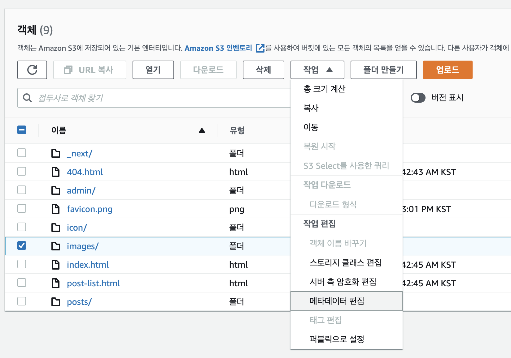
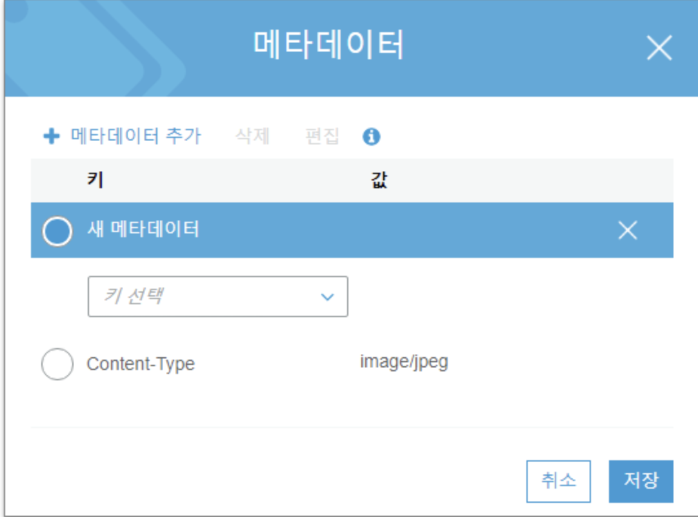
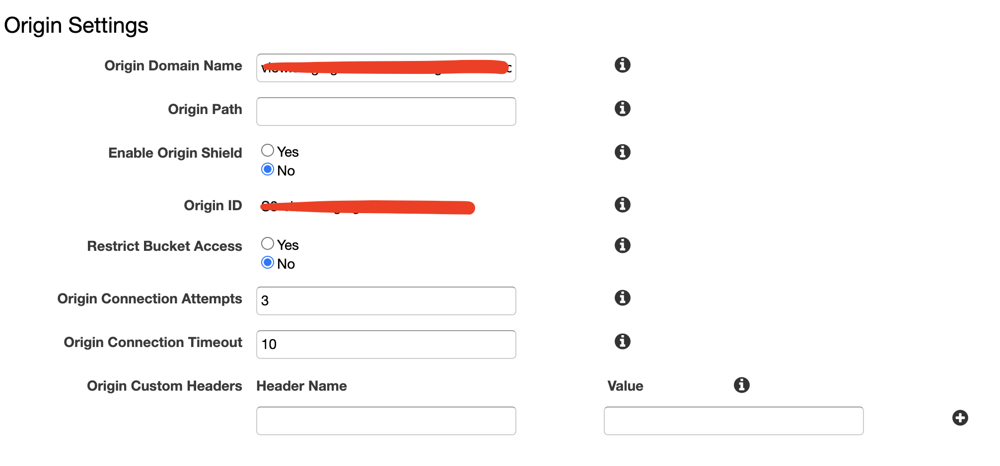
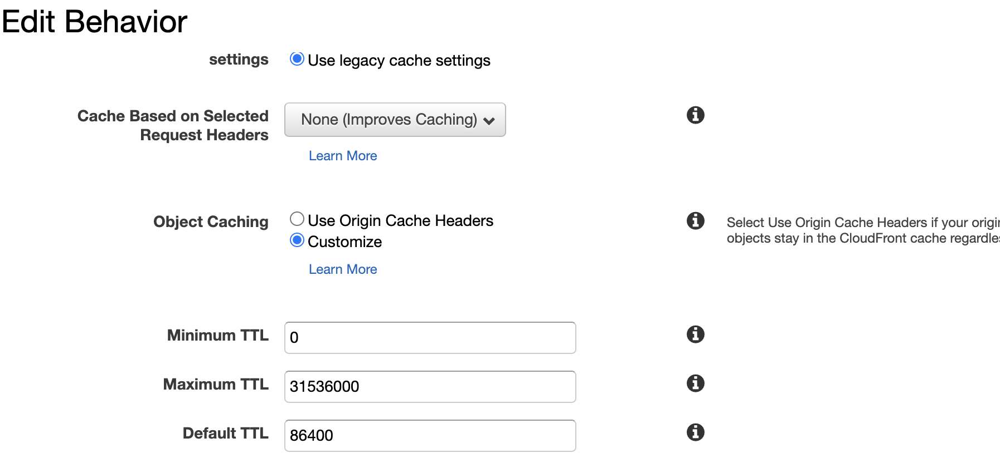
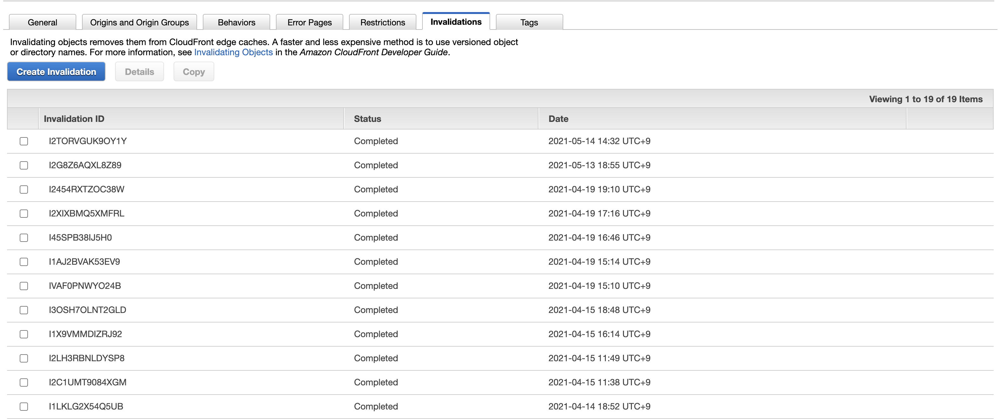

# Cache에 대하여

Cache는 성능을 향상시킬 수 있는 가장 첫 번째 방법입니다.

이번에는 CSR를 위한 S3, CloudFront caching 방법과 next.js를 이용해 SSR 서버를 구성할 때의 caching 방법을 정리했습니다.
캐시에 대한 정보는 [HTTP Cache](https://developer.mozilla.org/ko/docs/Web/HTTP/Caching)에서 확인할 수 있습니다.

# [AWS S3 Caching](https://docs.aws.amazon.com/AmazonS3/latest/userguide/UsingMetadata.html)

S3 버킷으로 들어가 캐싱하고자 하는 디렉토리 혹은 파일을 체크하고 메타데이터 편집을 클릭합니다.

그리고 Header 값을 추가합니다.

```shell
Cache-Control: max-age=180
```



# CloudFront Caching


CloudFront origins 에서 Origin Custom Headers가 있는데 여기에 적는건 아닙니다.(처음에 저곳에 header를 넣었다가 왜 안되지 했습니다...)

behaviors 탭의 Object Caching에서 설정할 수 있는데 만약에 S3에서 위에 정의한 Cache-Control 처럼 CloudFront에 캐싱하고 싶다면 `Use Origin Cache Headers`를 클릭하고, 자체적으로 셋팅하고 싶다면 `Customize`를 클릭하고 밑에 시간을 설정하면 됩니다. 하지만 Front를 새로 배포하여 S3에 올렸지만 CloudFront의 캐싱시간이 길어 업데이트가 안되는 경우가 있을 수 있는데, 이때는 invalidate를 해줘야합니다.


# Next.js Caching

Next.js에서는 custom-header setting으로 쉽게 캐싱할 수 있습니다.

```js
module.exports = {

  async headers() {
    return [
      {
        source: '/images',
        headers: [
          {
            key: 'Cache-Control',
            value:
              'public, max-age=180'
          },
        ],
      },
```
